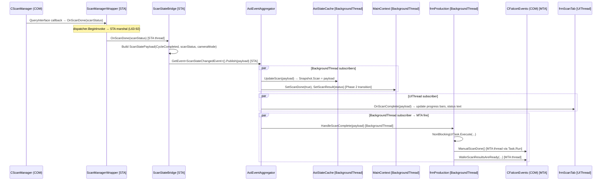
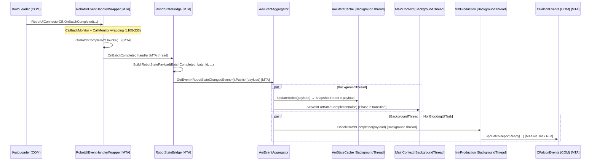
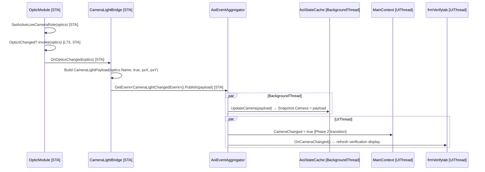
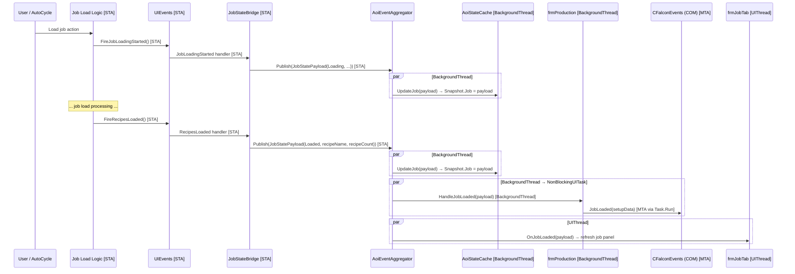
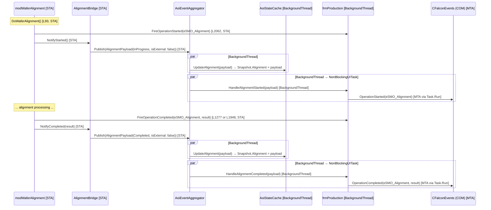
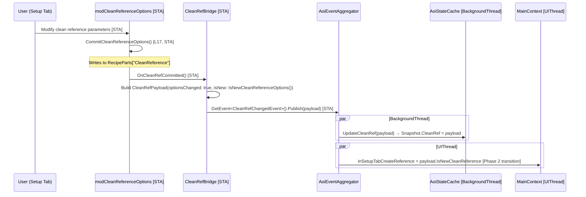
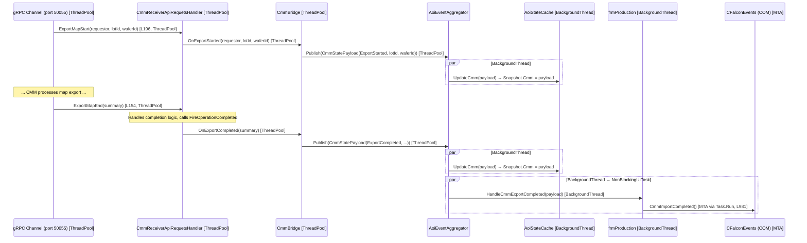
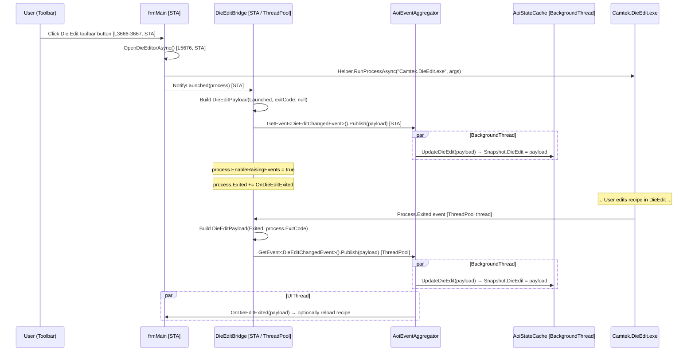
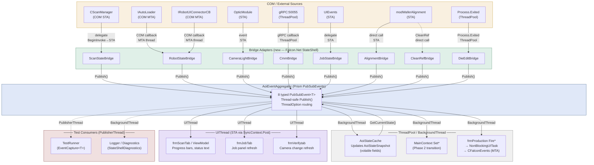

# State Shell Design — Falcon.Net / AOI_Main

> **Date:** 2026-04-05  
> **Input:** `structured_findings.md`, `alternatives_comparison.md`  
> **Architecture:** Hybrid Alternative 3 — Prism Event Aggregator + AoiStateCache  
> **Status:** Design only — no implementation code

---

## Table of Contents

1. [ADR-001: Hybrid Prism Event Aggregator + AoiStateCache](#1-adr-001-hybrid-prism-event-aggregator--aoistatecache)
2. [Full Class Diagram — State System Types](#2-full-class-diagram--state-system-types)
   - 2.1 [State Data Types (one per domain)](#21-state-data-types-one-per-domain) — 7 enums + 8 payload DTOs
   - 2.2 [Event Classes](#22-event-classes) — `AoiStateEventBase<T>` + 8 concrete events
   - 2.3 [Core Infrastructure](#23-core-infrastructure) — `IAoiEventAggregator`, `AoiStateSnapshot`, `AoiEventAggregator`, `AoiStateCache`
   - 2.4 [Bridge Adapters (one per domain)](#24-bridge-adapters-one-per-domain) — `IAoiStateBridge` + 8 bridges + orchestrator
   - 2.5 [Consumer API](#25-consumer-api) — Subscribe / Query / Unsubscribe examples
3. [Threading Model (Formal Specification)](#3-threading-model-formal-specification)
   - 3.1 [COM Event Path](#31-com-event-path--sta--non-blocking-publish) — STA → non-blocking publish
   - 3.2 [gRPC Callback Path (CMM)](#32-grpc-callback-path--cmm) — gRPC thread → publish
   - 3.3 [Direct Call Path](#33-direct-call-path--cleanref-die-edit-job-internal-events) — CleanRef, Die Edit, Job
   - 3.4 [Invariants](#34-invariants-enforced-by-design) — T1–T13 (enforced by design)
   - 3.5 [Thread Roles Summary](#35-thread-roles-summary-table)
   - 3.6 [Deadlock Prevention Rules](#36-deadlock-prevention-rules) — D1–D4
   - 3.7 [NonBlockingUITask Compatibility](#37-nonblockinguiTaskexecute-compatibility-migration-phases) — Phase 1/2/3
4. [Integration & Ownership Map](#4-integration--ownership-map)
   - 4.0 [Integration Table (9 Domains)](#40-integration-table-9-domains)
   - 4.1 [Ownership Transfer Map](#41-ownership-transfer-map)
   - 4.2 [Module Change Plan (Exact Files / Classes / Lines)](#42-module-change-plan-exact-files--classes--lines)
   - 4.3 [End-to-End Sequences (8 Domains)](#43-end-to-end-sequences-8-domains)
5. [Testability Contract](#5-testability-contract)
   - 5.1 [Design-Time Test Seams](#51-design-time-test-seams)
   - 5.2 [Testing Philosophy](#52-testing-philosophy)
   - 5.3 [Test Infrastructure](#53-test-infrastructure) — `TestEventAggregatorFactory`, `EventCapture<T>`, `StubBridge`, `TestSynchronizationContext`
   - 5.4 [Unit Test Patterns](#54-unit-test-patterns) — Bridge / Consumer / Threading / Current State
   - 5.5 [Orchestrator Lifecycle Tests](#55-orchestrator-lifecycle-tests)
   - 5.6 [Complete Test Scenario Matrix](#56-complete-test-scenario-matrix) — T1–T21
   - 5.7 [Testing Without COM / Hardware](#57-testing-without-com--hardware--summary)
6. [Error Handling & Diagnostics](#6-error-handling--diagnostics)
   - 6.1 [Failure Scenarios & Handling](#61-failure-scenarios--handling) — E1–E8
   - 6.2 [SafeHandler Wrapper](#62-safehandler-wrapper)
   - 6.3 [Logging Strategy](#63-logging-strategy)
   - 6.4 [Diagnostics API](#64-diagnostics-api)
7. [Architecture Summary Diagram](#7-architecture-summary-diagram)
A. [Appendix A: File / Line Quick Reference](#appendix-a-file--line-quick-reference)
B. [Appendix B: Glossary](#appendix-b-glossary)

---

## 1. ADR-001: Hybrid Prism Event Aggregator + AoiStateCache

### Status

**Accepted**

### Context

Falcon.Net/AOI_Main manages 8 state domains (Scan/Grab, Robot, Camera/Lights, Job, Alignment, Clean Reference, CMM, Die Edit) through a 5701-line `MainContext` singleton that mixes state storage, mutation, UI notification, and COM event firing. State mutations are scattered across `MainContextModule` setters, `frmProduction` Fire* methods, and form-level event handlers. This produces tight coupling between forms, modules, and COM infrastructure with no clear publish-subscribe boundaries.

The codebase runs on **.NET Framework 4.8** (no C# 9 records), uses **STA COM threading** with `NonBlockingUITask.Execute` for MTA offload, and already references `Microsoft.Practices.Prism.PubSubEvents` v1.0 (used in `SystemCalibration` with 15+ ViewModels).

### Decision

Adopt **Prism `PubSubEvent<TPayload>` as the in-process event bus** with an **`AoiStateCache` companion** for queryable last-known state.

### Alternatives Considered

| Alternative | Score | Rejection Reason |
|---|---|---|
| Alt 1: Redux Store | 3.45 | .NET 4.8 lacks records; manual immutability is verbose/fragile |
| Alt 2: Rx.NET | 3.15 | New dependency; high learning curve; silent `OnError` subscription death |
| **Alt 3: Prism EA (chosen)** | **4.55** | Zero new deps; team-familiar; thread-safe `Publish()`/`Subscribe()` |

### Consequences

- **Positive:** Zero dependency additions. Incremental migration (one domain at a time). Prism `ThreadOption` replaces manual `Dispatcher.BeginInvoke` / `NonBlockingUITask.Execute` threading.
- **Negative:** No built-in cross-domain composition operators (mitigated by `AoiStateCache` for imperative cross-queries). No virtual-time testing (mitigated by synchronous `ThreadOption.PublisherThread` in tests).
- **Risks:** Subscription leaks if `Unsubscribe()` / `SubscriptionToken.Dispose()` is not called. Mitigated by enforcing `IDisposable` on all bridge adapters and subscribing forms.

---

## 2. Full Class Diagram — State System Types

> **Constraints (all types):** .NET Framework 4.8 · no C# 9 `record` · immutable via `readonly` fields · `[Serializable]` · `ToString()` override for diagnostics

### 2.1 State Data Types (one per domain)

#### 2.1.1 Enums

```csharp
/// <summary>Scan/Grab lifecycle phase.</summary>
[Serializable]
public enum ScanStatus
{
    Idle,
    Starting,
    Grabbing,
    ColorGrab,
    Aborting,
    Complete,
    Error
}

/// <summary>Camera acquisition mode.</summary>
[Serializable]
public enum CameraMode
{
    Mono,
    Color,
    CSP,
    TDI,
    StilWhiteLight,
    StilLaser,
    CLIP
}

/// <summary>Robot / EFEM operational phase.</summary>
[Serializable]
public enum RobotStatus
{
    Offline,
    Idle,
    Loading,
    Unloading,
    Aligning,
    InAutoCycle,
    Paused,
    Error
}

/// <summary>Job lifecycle.</summary>
[Serializable]
public enum JobStatus
{
    None,
    Loading,
    Loaded,
    Running,
    Deleted
}

/// <summary>Alignment result.</summary>
[Serializable]
public enum AlignmentResult
{
    NotStarted,
    InProgress,
    Pass,
    Fail
}

/// <summary>CMM export lifecycle.</summary>
[Serializable]
public enum CmmPhase
{
    Idle,
    Open,
    Importing,
    Exporting,
    Done,
    Error
}

/// <summary>Die-edit operation kind.</summary>
[Serializable]
public enum DieEditType
{
    Reclassify,
    Exclude,
    Restore
}
```

#### 2.1.2 ScanStatePayload

```
ScanStatePayload
├── Status          : ScanStatus       (enum)
├── WaferId         : string
├── ScanId          : Guid
├── ProgressPercent : int              (0-100)
├── CameraMode      : CameraMode       (enum)
├── StartTimeUtc    : DateTime
├── ElapsedMs       : long
└── ErrorMessage    : string           (null if no error)
```

```csharp
/// <summary>Domain 1 — Scan / Grab state payload. Immutable.</summary>
[Serializable]
public sealed class ScanStatePayload
{
    private readonly ScanStatus  _status;
    private readonly string      _waferId;
    private readonly Guid        _scanId;
    private readonly int         _progressPercent;
    private readonly CameraMode  _cameraMode;
    private readonly DateTime    _startTimeUtc;
    private readonly long        _elapsedMs;
    private readonly string      _errorMessage;

    public ScanStatus  Status          { get { return _status; } }
    public string      WaferId         { get { return _waferId; } }
    public Guid        ScanId          { get { return _scanId; } }
    public int         ProgressPercent { get { return _progressPercent; } }
    public CameraMode  CameraMode      { get { return _cameraMode; } }
    public DateTime    StartTimeUtc    { get { return _startTimeUtc; } }
    public long        ElapsedMs       { get { return _elapsedMs; } }
    public string      ErrorMessage    { get { return _errorMessage; } }

    public ScanStatePayload(
        ScanStatus status,
        string waferId,
        Guid scanId,
        int progressPercent,
        CameraMode cameraMode,
        DateTime startTimeUtc,
        long elapsedMs,
        string errorMessage)
    {
        _status          = status;
        _waferId         = waferId;
        _scanId          = scanId;
        _progressPercent = Math.Max(0, Math.Min(100, progressPercent));
        _cameraMode      = cameraMode;
        _startTimeUtc    = startTimeUtc;
        _elapsedMs       = elapsedMs;
        _errorMessage    = errorMessage;
    }

    public override string ToString()
    {
        return string.Format(
            "[Scan] Status={0}, Wafer={1}, Id={2}, Progress={3}%, Camera={4}, Elapsed={5}ms, Error={6}",
            _status, _waferId ?? "(null)", _scanId, _progressPercent,
            _cameraMode, _elapsedMs, _errorMessage ?? "(none)");
    }
}
```

#### 2.1.3 RobotStatePayload

```
RobotStatePayload
├── Status                       : RobotStatus (enum)
├── WaferId                      : string
├── LotId                        : string
├── SlotNumber                   : int
├── CassetteId                   : string
├── InProductionMode             : bool
├── BatchCompleted               : bool
├── ManualCassetteMappingRequested : bool
├── ToolStateDescription         : string      (readable summary of last tool-state change)
└── ErrorMessage                 : string      (null if no error)
```

```csharp
/// <summary>Domain 2 — Robot / EFEM / Loader state payload. Immutable.</summary>
[Serializable]
public sealed class RobotStatePayload
{
    private readonly RobotStatus _status;
    private readonly string      _waferId;
    private readonly string      _lotId;
    private readonly int         _slotNumber;
    private readonly string      _cassetteId;
    private readonly bool        _inProductionMode;
    private readonly bool        _batchCompleted;
    private readonly bool        _manualCassetteMappingRequested;
    private readonly string      _toolStateDescription;
    private readonly string      _errorMessage;

    public RobotStatus Status                          { get { return _status; } }
    public string      WaferId                         { get { return _waferId; } }
    public string      LotId                           { get { return _lotId; } }
    public int         SlotNumber                      { get { return _slotNumber; } }
    public string      CassetteId                      { get { return _cassetteId; } }
    public bool        InProductionMode                { get { return _inProductionMode; } }
    public bool        BatchCompleted                  { get { return _batchCompleted; } }
    public bool        ManualCassetteMappingRequested  { get { return _manualCassetteMappingRequested; } }
    public string      ToolStateDescription            { get { return _toolStateDescription; } }
    public string      ErrorMessage                    { get { return _errorMessage; } }

    public RobotStatePayload(
        RobotStatus status,
        string waferId,
        string lotId,
        int slotNumber,
        string cassetteId,
        bool inProductionMode,
        bool batchCompleted,
        bool manualCassetteMappingRequested,
        string toolStateDescription,
        string errorMessage)
    {
        _status                         = status;
        _waferId                        = waferId;
        _lotId                          = lotId;
        _slotNumber                     = slotNumber;
        _cassetteId                     = cassetteId;
        _inProductionMode               = inProductionMode;
        _batchCompleted                 = batchCompleted;
        _manualCassetteMappingRequested = manualCassetteMappingRequested;
        _toolStateDescription           = toolStateDescription;
        _errorMessage                   = errorMessage;
    }

    public override string ToString()
    {
        return string.Format(
            "[Robot] Status={0}, Wafer={1}, Lot={2}, Slot={3}, Cassette={4}, Prod={5}, Batch={6}, Error={7}",
            _status, _waferId ?? "(null)", _lotId ?? "(null)", _slotNumber,
            _cassetteId ?? "(null)", _inProductionMode, _batchCompleted,
            _errorMessage ?? "(none)");
    }
}
```

#### 2.1.4 CameraLightPayload

```
CameraLightPayload
├── CameraId            : string       (e.g. "Cam1", "Cam2")
├── Channel             : int          (0-based channel index)
├── Intensity           : float        (0.0–100.0 %)
├── Objective           : string       (e.g. "10x", "50x")
├── IlluminationActive  : bool
├── PixelSizeX          : float        (µm/pixel)
├── PixelSizeY          : float        (µm/pixel)
└── CameraMode          : CameraMode   (enum — shared with scan)
```

```csharp
/// <summary>Domain 3 — Camera / Lights state payload. Immutable.</summary>
[Serializable]
public sealed class CameraLightPayload
{
    private readonly string     _cameraId;
    private readonly int        _channel;
    private readonly float      _intensity;
    private readonly string     _objective;
    private readonly bool       _illuminationActive;
    private readonly float      _pixelSizeX;
    private readonly float      _pixelSizeY;
    private readonly CameraMode _cameraMode;

    public string     CameraId           { get { return _cameraId; } }
    public int        Channel            { get { return _channel; } }
    public float      Intensity          { get { return _intensity; } }
    public string     Objective          { get { return _objective; } }
    public bool       IlluminationActive { get { return _illuminationActive; } }
    public float      PixelSizeX         { get { return _pixelSizeX; } }
    public float      PixelSizeY         { get { return _pixelSizeY; } }
    public CameraMode CameraMode         { get { return _cameraMode; } }

    public CameraLightPayload(
        string cameraId,
        int channel,
        float intensity,
        string objective,
        bool illuminationActive,
        float pixelSizeX,
        float pixelSizeY,
        CameraMode cameraMode)
    {
        _cameraId           = cameraId;
        _channel            = channel;
        _intensity          = intensity;
        _objective          = objective;
        _illuminationActive = illuminationActive;
        _pixelSizeX         = pixelSizeX;
        _pixelSizeY         = pixelSizeY;
        _cameraMode         = cameraMode;
    }

    public override string ToString()
    {
        return string.Format(
            "[Camera] Id={0}, Ch={1}, Intensity={2:F1}%, Obj={3}, Illum={4}, Px={5:F3}x{6:F3}, Mode={7}",
            _cameraId ?? "(null)", _channel, _intensity, _objective ?? "(null)",
            _illuminationActive, _pixelSizeX, _pixelSizeY, _cameraMode);
    }
}
```

#### 2.1.5 JobStatePayload

```
JobStatePayload
├── JobName         : string
├── JobPath         : string
├── Status          : JobStatus    (enum: None | Loading | Loaded | Running | Deleted)
├── RecipeCount     : int
├── ScanModeChanged : bool
├── InRecipeChange  : bool
├── RefChanged      : bool
└── RecipeSummary   : string       (pipe-delimited list of recipe names, for logging)
```

```csharp
/// <summary>Domain 4 — Job state payload. Immutable.</summary>
[Serializable]
public sealed class JobStatePayload
{
    private readonly string    _jobName;
    private readonly string    _jobPath;
    private readonly JobStatus _status;
    private readonly int       _recipeCount;
    private readonly bool      _scanModeChanged;
    private readonly bool      _inRecipeChange;
    private readonly bool      _refChanged;
    private readonly string    _recipeSummary;

    public string    JobName         { get { return _jobName; } }
    public string    JobPath         { get { return _jobPath; } }
    public JobStatus Status          { get { return _status; } }
    public int       RecipeCount     { get { return _recipeCount; } }
    public bool      ScanModeChanged { get { return _scanModeChanged; } }
    public bool      InRecipeChange  { get { return _inRecipeChange; } }
    public bool      RefChanged      { get { return _refChanged; } }
    public string    RecipeSummary   { get { return _recipeSummary; } }

    public JobStatePayload(
        string jobName,
        string jobPath,
        JobStatus status,
        int recipeCount,
        bool scanModeChanged,
        bool inRecipeChange,
        bool refChanged,
        string recipeSummary)
    {
        _jobName         = jobName;
        _jobPath         = jobPath;
        _status          = status;
        _recipeCount     = recipeCount;
        _scanModeChanged = scanModeChanged;
        _inRecipeChange  = inRecipeChange;
        _refChanged      = refChanged;
        _recipeSummary   = recipeSummary;
    }

    public override string ToString()
    {
        return string.Format(
            "[Job] Name={0}, Path={1}, Status={2}, Recipes={3}, ScanModeChg={4}, RecipeChg={5}, RefChg={6}",
            _jobName ?? "(null)", _jobPath ?? "(null)", _status,
            _recipeCount, _scanModeChanged, _inRecipeChange, _refChanged);
    }
}
```

#### 2.1.6 AlignmentPayload

```
AlignmentPayload
├── OffsetXMicrons   : double      (µm)
├── OffsetYMicrons   : double      (µm)
├── AngleMrad        : double      (mrad)
├── WaferId          : string
├── Result           : AlignmentResult (enum: NotStarted | InProgress | Pass | Fail)
├── TimestampUtc     : DateTime
├── AlgorithmUsed    : string      (e.g. "FineAlign", "CoarseAlign", "ExternalCoord")
└── IsExternalCoordSystem : bool
```

```csharp
/// <summary>Domain 5 — Alignment state payload. Immutable.</summary>
[Serializable]
public sealed class AlignmentPayload
{
    private readonly double          _offsetXMicrons;
    private readonly double          _offsetYMicrons;
    private readonly double          _angleMrad;
    private readonly string          _waferId;
    private readonly AlignmentResult _result;
    private readonly DateTime        _timestampUtc;
    private readonly string          _algorithmUsed;
    private readonly bool            _isExternalCoordSystem;

    public double          OffsetXMicrons       { get { return _offsetXMicrons; } }
    public double          OffsetYMicrons       { get { return _offsetYMicrons; } }
    public double          AngleMrad            { get { return _angleMrad; } }
    public string          WaferId              { get { return _waferId; } }
    public AlignmentResult Result               { get { return _result; } }
    public DateTime        TimestampUtc         { get { return _timestampUtc; } }
    public string          AlgorithmUsed        { get { return _algorithmUsed; } }
    public bool            IsExternalCoordSystem { get { return _isExternalCoordSystem; } }

    public AlignmentPayload(
        double offsetXMicrons,
        double offsetYMicrons,
        double angleMrad,
        string waferId,
        AlignmentResult result,
        DateTime timestampUtc,
        string algorithmUsed,
        bool isExternalCoordSystem)
    {
        _offsetXMicrons       = offsetXMicrons;
        _offsetYMicrons       = offsetYMicrons;
        _angleMrad            = angleMrad;
        _waferId              = waferId;
        _result               = result;
        _timestampUtc         = timestampUtc;
        _algorithmUsed        = algorithmUsed;
        _isExternalCoordSystem = isExternalCoordSystem;
    }

    public override string ToString()
    {
        return string.Format(
            "[Align] dX={0:F2}µm, dY={1:F2}µm, Angle={2:F4}mrad, Wafer={3}, Result={4}, Algo={5}, ExtCoord={6}",
            _offsetXMicrons, _offsetYMicrons, _angleMrad,
            _waferId ?? "(null)", _result, _algorithmUsed ?? "(null)", _isExternalCoordSystem);
    }
}
```

#### 2.1.7 CleanRefPayload

```
CleanRefPayload
├── IsValid          : bool
├── CameraId         : string
├── CaptureTimestampUtc : DateTime
├── FilePath         : string      (path to reference image/data file)
└── ReasonForClean   : string      (e.g. "ScheduledPeriodic", "UserRequest", "AutoTrigger")
```

```csharp
/// <summary>Domain 6 — Clean Reference state payload. Immutable.</summary>
[Serializable]
public sealed class CleanRefPayload
{
    private readonly bool     _isValid;
    private readonly string   _cameraId;
    private readonly DateTime _captureTimestampUtc;
    private readonly string   _filePath;
    private readonly string   _reasonForClean;

    public bool     IsValid              { get { return _isValid; } }
    public string   CameraId             { get { return _cameraId; } }
    public DateTime CaptureTimestampUtc  { get { return _captureTimestampUtc; } }
    public string   FilePath             { get { return _filePath; } }
    public string   ReasonForClean       { get { return _reasonForClean; } }

    public CleanRefPayload(
        bool isValid,
        string cameraId,
        DateTime captureTimestampUtc,
        string filePath,
        string reasonForClean)
    {
        _isValid             = isValid;
        _cameraId            = cameraId;
        _captureTimestampUtc = captureTimestampUtc;
        _filePath            = filePath;
        _reasonForClean      = reasonForClean;
    }

    public override string ToString()
    {
        return string.Format(
            "[CleanRef] Valid={0}, Camera={1}, Captured={2:O}, Path={3}, Reason={4}",
            _isValid, _cameraId ?? "(null)", _captureTimestampUtc,
            _filePath ?? "(null)", _reasonForClean ?? "(null)");
    }
}
```

#### 2.1.8 CmmStatePayload

```
CmmStatePayload
├── Phase       : CmmPhase    (enum: Idle | Open | Importing | Exporting | Done | Error)
├── TicketId    : string
├── ExportPath  : string
├── LotId       : string
├── WaferId     : string
├── ErrorCode   : int         (0 = no error)
└── ErrorMessage : string     (null if no error)
```

```csharp
/// <summary>Domain 7 — CMM state payload. Immutable.</summary>
[Serializable]
public sealed class CmmStatePayload
{
    private readonly CmmPhase _phase;
    private readonly string   _ticketId;
    private readonly string   _exportPath;
    private readonly string   _lotId;
    private readonly string   _waferId;
    private readonly int      _errorCode;
    private readonly string   _errorMessage;

    public CmmPhase Phase        { get { return _phase; } }
    public string   TicketId     { get { return _ticketId; } }
    public string   ExportPath   { get { return _exportPath; } }
    public string   LotId        { get { return _lotId; } }
    public string   WaferId      { get { return _waferId; } }
    public int      ErrorCode    { get { return _errorCode; } }
    public string   ErrorMessage { get { return _errorMessage; } }

    public CmmStatePayload(
        CmmPhase phase,
        string ticketId,
        string exportPath,
        string lotId,
        string waferId,
        int errorCode,
        string errorMessage)
    {
        _phase        = phase;
        _ticketId     = ticketId;
        _exportPath   = exportPath;
        _lotId        = lotId;
        _waferId      = waferId;
        _errorCode    = errorCode;
        _errorMessage = errorMessage;
    }

    public override string ToString()
    {
        return string.Format(
            "[CMM] Phase={0}, Ticket={1}, Export={2}, Lot={3}, Wafer={4}, ErrCode={5}, Err={6}",
            _phase, _ticketId ?? "(null)", _exportPath ?? "(null)",
            _lotId ?? "(null)", _waferId ?? "(null)", _errorCode,
            _errorMessage ?? "(none)");
    }
}
```

#### 2.1.9 DieEditPayload

```
DieEditPayload
├── WaferId        : string
├── DieRow         : int
├── DieCol         : int
├── EditType       : DieEditType  (enum: Reclassify | Exclude | Restore)
├── BeforeValue    : string       (original bin/class value)
├── AfterValue     : string       (new bin/class value; null for Exclude)
├── TimestampUtc   : DateTime
└── OperatorId     : string
```

```csharp
/// <summary>Domain 8 — Die Edit state payload. Immutable.</summary>
[Serializable]
public sealed class DieEditPayload
{
    private readonly string      _waferId;
    private readonly int         _dieRow;
    private readonly int         _dieCol;
    private readonly DieEditType _editType;
    private readonly string      _beforeValue;
    private readonly string      _afterValue;
    private readonly DateTime    _timestampUtc;
    private readonly string      _operatorId;

    public string      WaferId      { get { return _waferId; } }
    public int         DieRow       { get { return _dieRow; } }
    public int         DieCol       { get { return _dieCol; } }
    public DieEditType EditType     { get { return _editType; } }
    public string      BeforeValue  { get { return _beforeValue; } }
    public string      AfterValue   { get { return _afterValue; } }
    public DateTime    TimestampUtc { get { return _timestampUtc; } }
    public string      OperatorId   { get { return _operatorId; } }

    public DieEditPayload(
        string waferId,
        int dieRow,
        int dieCol,
        DieEditType editType,
        string beforeValue,
        string afterValue,
        DateTime timestampUtc,
        string operatorId)
    {
        _waferId      = waferId;
        _dieRow       = dieRow;
        _dieCol       = dieCol;
        _editType     = editType;
        _beforeValue  = beforeValue;
        _afterValue   = afterValue;
        _timestampUtc = timestampUtc;
        _operatorId   = operatorId;
    }

    public override string ToString()
    {
        return string.Format(
            "[DieEdit] Wafer={0}, Die=({1},{2}), Type={3}, Before={4}, After={5}, Op={6}, At={7:O}",
            _waferId ?? "(null)", _dieRow, _dieCol, _editType,
            _beforeValue ?? "(null)", _afterValue ?? "(null)",
            _operatorId ?? "(null)", _timestampUtc);
    }
}
```

### 2.2 Event Classes

All events derive from a generic base that wraps the payload with metadata:

```
AoiStateEventBase<TPayload>                          (abstract)
├── Payload      : TPayload       (the domain DTO)
├── TimestampUtc : DateTime        (when the event was created)
└── SequenceNo   : long            (monotonic — detects missed events)

Concrete derivations:
  ScanStateChangedEvent    : AoiStateEventBase<ScanStatePayload>
  RobotStateChangedEvent   : AoiStateEventBase<RobotStatePayload>
  CameraLightChangedEvent  : AoiStateEventBase<CameraLightPayload>
  JobStateChangedEvent     : AoiStateEventBase<JobStatePayload>
  AlignmentChangedEvent    : AoiStateEventBase<AlignmentPayload>
  CleanRefChangedEvent     : AoiStateEventBase<CleanRefPayload>
  CmmStateChangedEvent     : AoiStateEventBase<CmmStatePayload>
  DieEditChangedEvent      : AoiStateEventBase<DieEditPayload>
```

```csharp
using System;
using System.Threading;

/// <summary>
/// Base class for all AOI state-change events.
/// Carries the typed payload plus envelope metadata (timestamp, sequence number).
/// The sequence counter is process-wide and monotonically increasing.
/// </summary>
[Serializable]
public abstract class AoiStateEventBase<TPayload>
{
    private static long s_globalSequence; // shared across all TPayload types

    private readonly TPayload _payload;
    private readonly DateTime _timestampUtc;
    private readonly long     _sequenceNo;

    public TPayload Payload      { get { return _payload; } }
    public DateTime TimestampUtc { get { return _timestampUtc; } }
    public long     SequenceNo   { get { return _sequenceNo; } }

    protected AoiStateEventBase(TPayload payload)
    {
        _payload      = payload;
        _timestampUtc = DateTime.UtcNow;
        _sequenceNo   = Interlocked.Increment(ref s_globalSequence);
    }

    public override string ToString()
    {
        return string.Format("[#{0} @{1:O}] {2}", _sequenceNo, _timestampUtc, _payload);
    }
}

// ─── Concrete event classes (one per domain) ────────────────────────────

[Serializable]
public sealed class ScanStateChangedEvent : AoiStateEventBase<ScanStatePayload>
{
    public ScanStateChangedEvent(ScanStatePayload payload) : base(payload) { }
}

[Serializable]
public sealed class RobotStateChangedEvent : AoiStateEventBase<RobotStatePayload>
{
    public RobotStateChangedEvent(RobotStatePayload payload) : base(payload) { }
}

[Serializable]
public sealed class CameraLightChangedEvent : AoiStateEventBase<CameraLightPayload>
{
    public CameraLightChangedEvent(CameraLightPayload payload) : base(payload) { }
}

[Serializable]
public sealed class JobStateChangedEvent : AoiStateEventBase<JobStatePayload>
{
    public JobStateChangedEvent(JobStatePayload payload) : base(payload) { }
}

[Serializable]
public sealed class AlignmentChangedEvent : AoiStateEventBase<AlignmentPayload>
{
    public AlignmentChangedEvent(AlignmentPayload payload) : base(payload) { }
}

[Serializable]
public sealed class CleanRefChangedEvent : AoiStateEventBase<CleanRefPayload>
{
    public CleanRefChangedEvent(CleanRefPayload payload) : base(payload) { }
}

[Serializable]
public sealed class CmmStateChangedEvent : AoiStateEventBase<CmmStatePayload>
{
    public CmmStateChangedEvent(CmmStatePayload payload) : base(payload) { }
}

[Serializable]
public sealed class DieEditChangedEvent : AoiStateEventBase<DieEditPayload>
{
    public DieEditChangedEvent(DieEditPayload payload) : base(payload) { }
}
```

### 2.3 Core Infrastructure

#### 2.3.1 AoiThreadOption Enum

```csharp
/// <summary>
/// Determines which thread the subscriber callback runs on.
/// Maps 1-to-1 to Prism ThreadOption values internally.
/// </summary>
public enum AoiThreadOption
{
    /// <summary>Handler runs on the thread that called Publish().</summary>
    PublisherThread,
    /// <summary>Handler dispatched to ThreadPool.</summary>
    BackgroundThread,
    /// <summary>Handler dispatched via SynchronizationContext (WinForms UI thread).</summary>
    UIThread
}
```

#### 2.3.2 IAoiEventAggregator

```
IAoiEventAggregator
├── Publish<TEvent>(TEvent evt)                                : void         [thread-safe, non-blocking]
├── Subscribe<TEvent>(Action<TEvent> handler, AoiThreadOption) : IDisposable  [returns token for cleanup]
└── GetCurrentState()                                          : AoiStateSnapshot [last known state per domain]
```

```csharp
using System;
using System.Collections.Concurrent;
using System.Collections.Generic;
using System.Threading;
using Microsoft.Practices.Prism.PubSubEvents;

/// <summary>
/// Façade over Prism <see cref="IEventAggregator"/>. 
/// Adds the envelope pattern (sequence numbering, snapshot), hides Prism namespace from consumers.
/// </summary>
public interface IAoiEventAggregator
{
    /// <summary>Publish an event. Thread-safe; never blocks the caller.</summary>
    void Publish<TEvent>(TEvent evt) where TEvent : class;

    /// <summary>Subscribe to an event type. Returns an IDisposable token for unsubscription.</summary>
    IDisposable Subscribe<TEvent>(Action<TEvent> handler, AoiThreadOption threadOption)
        where TEvent : class;

    /// <summary>Returns the last-known state per domain (null if not yet received).</summary>
    AoiStateSnapshot GetCurrentState();
}
```

#### 2.3.3 AoiStateSnapshot

```
AoiStateSnapshot                          (read-only reference type)
├── Scan        : ScanStatePayload        (last known, or null)
├── Robot       : RobotStatePayload
├── CameraLight : CameraLightPayload
├── Job         : JobStatePayload
├── Alignment   : AlignmentPayload
├── CleanRef    : CleanRefPayload
├── Cmm         : CmmStatePayload
└── DieEdit     : DieEditPayload
```

```csharp
/// <summary>
/// Thread-safe read-only view of the last-known state for each domain.
/// Domain slots are atomically swapped (reference assignment under volatile read).
/// Callers may read any property from any thread without locking.
/// </summary>
public sealed class AoiStateSnapshot
{
    // Volatile fields — atomic reference swap; no lock needed for reads/writes
    // on 64-bit or 32-bit .NET where reference assignments are atomic.
    private volatile ScanStatePayload    _scan;
    private volatile RobotStatePayload   _robot;
    private volatile CameraLightPayload  _cameraLight;
    private volatile JobStatePayload     _job;
    private volatile AlignmentPayload    _alignment;
    private volatile CleanRefPayload     _cleanRef;
    private volatile CmmStatePayload     _cmm;
    private volatile DieEditPayload      _dieEdit;

    public ScanStatePayload    Scan        { get { return _scan; } }
    public RobotStatePayload   Robot       { get { return _robot; } }
    public CameraLightPayload  CameraLight { get { return _cameraLight; } }
    public JobStatePayload     Job         { get { return _job; } }
    public AlignmentPayload    Alignment   { get { return _alignment; } }
    public CleanRefPayload     CleanRef    { get { return _cleanRef; } }
    public CmmStatePayload     Cmm         { get { return _cmm; } }
    public DieEditPayload      DieEdit     { get { return _dieEdit; } }

    internal void UpdateScan(ScanStatePayload p)           { _scan = p; }
    internal void UpdateRobot(RobotStatePayload p)         { _robot = p; }
    internal void UpdateCameraLight(CameraLightPayload p)  { _cameraLight = p; }
    internal void UpdateJob(JobStatePayload p)             { _job = p; }
    internal void UpdateAlignment(AlignmentPayload p)      { _alignment = p; }
    internal void UpdateCleanRef(CleanRefPayload p)        { _cleanRef = p; }
    internal void UpdateCmm(CmmStatePayload p)             { _cmm = p; }
    internal void UpdateDieEdit(DieEditPayload p)          { _dieEdit = p; }

    public override string ToString()
    {
        return string.Format(
            "Snapshot[Scan={0}, Robot={1}, Cam={2}, Job={3}, Align={4}, Ref={5}, Cmm={6}, Die={7}]",
            _scan != null ? _scan.Status.ToString() : "null",
            _robot != null ? _robot.Status.ToString() : "null",
            _cameraLight != null ? _cameraLight.CameraId ?? "?" : "null",
            _job != null ? _job.Status.ToString() : "null",
            _alignment != null ? _alignment.Result.ToString() : "null",
            _cleanRef != null ? _cleanRef.IsValid.ToString() : "null",
            _cmm != null ? _cmm.Phase.ToString() : "null",
            _dieEdit != null ? _dieEdit.EditType.ToString() : "null");
    }
}
```

#### 2.3.4 AoiEventAggregator (implementation)

```
AoiEventAggregator : IAoiEventAggregator
├── [internal] IEventAggregator _inner              (Prism instance)
├── [internal] AoiStateSnapshot _currentState       (written by internal subscribers)
├── [internal] long _sequenceCounter                (Interlocked.Increment per Publish)
├── Publish<TEvent>(evt)                            → PubSubEvent<TEvent>.Publish(evt)
├── Subscribe<TEvent>(handler, thread)              → PubSubEvent<TEvent>.Subscribe(...)
└── GetCurrentState()                               → return _currentState
```

```csharp
using System;
using System.Threading;
using Microsoft.Practices.Prism.PubSubEvents;

/// <summary>
/// Concrete event aggregator. Wraps Prism EA, maintains snapshot, issues sequence numbers.
/// </summary>
public sealed class AoiEventAggregator : IAoiEventAggregator, IDisposable
{
    private readonly IEventAggregator _inner;
    private readonly AoiStateSnapshot _currentState = new AoiStateSnapshot();
    private readonly AoiStateCache    _cache;

    public AoiEventAggregator()
    {
        _inner = new EventAggregator();
        _cache = new AoiStateCache(_currentState);
        _cache.Initialize(this);
    }

    // DI / testing: inject a mock Prism IEventAggregator
    public AoiEventAggregator(IEventAggregator inner)
    {
        _inner = inner ?? throw new ArgumentNullException("inner");
        _currentState = new AoiStateSnapshot();
        _cache = new AoiStateCache(_currentState);
        _cache.Initialize(this);
    }

    public void Publish<TEvent>(TEvent evt) where TEvent : class
    {
        if (evt == null) throw new ArgumentNullException("evt");
        _inner.GetEvent<WrappedPubSubEvent<TEvent>>().Publish(evt);
    }

    public IDisposable Subscribe<TEvent>(Action<TEvent> handler, AoiThreadOption threadOption)
        where TEvent : class
    {
        if (handler == null) throw new ArgumentNullException("handler");
        ThreadOption prismOption = MapThreadOption(threadOption);
        SubscriptionToken token = _inner
            .GetEvent<WrappedPubSubEvent<TEvent>>()
            .Subscribe(handler, prismOption);
        return new SubscriptionTokenDisposable(token);
    }

    public AoiStateSnapshot GetCurrentState()
    {
        return _currentState;
    }

    public void Dispose()
    {
        _cache.Dispose();
    }

    // ── helpers ──────────────────────────────────────────────────────

    private static ThreadOption MapThreadOption(AoiThreadOption opt)
    {
        switch (opt)
        {
            case AoiThreadOption.PublisherThread:  return ThreadOption.PublisherThread;
            case AoiThreadOption.BackgroundThread: return ThreadOption.BackgroundThread;
            case AoiThreadOption.UIThread:         return ThreadOption.UIThread;
            default: throw new ArgumentOutOfRangeException("opt");
        }
    }

    /// <summary>Wraps SubscriptionToken as IDisposable for the consumer API.</summary>
    private sealed class SubscriptionTokenDisposable : IDisposable
    {
        private SubscriptionToken _token;
        public SubscriptionTokenDisposable(SubscriptionToken token) { _token = token; }
        public void Dispose()
        {
            SubscriptionToken t = Interlocked.Exchange(ref _token, null);
            if (t != null) t.Dispose();
        }
    }

    /// <summary>
    /// Thin PubSubEvent&lt;T&gt; wrapper used internally to register
    /// with Prism's type-keyed dictionary (one event instance per T).
    /// </summary>
    private sealed class WrappedPubSubEvent<T> : PubSubEvent<T> { }
}
```

#### 2.3.5 AoiStateCache (internal snapshot updater)

```csharp
using System;
using System.Collections.Generic;
using Microsoft.Practices.Prism.PubSubEvents;

/// <summary>
/// Internal component that subscribes to all 8 domain events and keeps the
/// <see cref="AoiStateSnapshot"/> up-to-date. Not exposed to consumers —
/// they use <see cref="IAoiEventAggregator.GetCurrentState()"/> instead.
/// </summary>
internal sealed class AoiStateCache : IDisposable
{
    private readonly AoiStateSnapshot _snapshot;
    private readonly List<IDisposable> _subscriptions = new List<IDisposable>(8);

    public AoiStateCache(AoiStateSnapshot snapshot)
    {
        _snapshot = snapshot ?? throw new ArgumentNullException("snapshot");
    }

    public void Initialize(IAoiEventAggregator ea)
    {
        _subscriptions.Add(ea.Subscribe<ScanStateChangedEvent>(
            e => _snapshot.UpdateScan(e.Payload), AoiThreadOption.BackgroundThread));
        _subscriptions.Add(ea.Subscribe<RobotStateChangedEvent>(
            e => _snapshot.UpdateRobot(e.Payload), AoiThreadOption.BackgroundThread));
        _subscriptions.Add(ea.Subscribe<CameraLightChangedEvent>(
            e => _snapshot.UpdateCameraLight(e.Payload), AoiThreadOption.BackgroundThread));
        _subscriptions.Add(ea.Subscribe<JobStateChangedEvent>(
            e => _snapshot.UpdateJob(e.Payload), AoiThreadOption.BackgroundThread));
        _subscriptions.Add(ea.Subscribe<AlignmentChangedEvent>(
            e => _snapshot.UpdateAlignment(e.Payload), AoiThreadOption.BackgroundThread));
        _subscriptions.Add(ea.Subscribe<CleanRefChangedEvent>(
            e => _snapshot.UpdateCleanRef(e.Payload), AoiThreadOption.BackgroundThread));
        _subscriptions.Add(ea.Subscribe<CmmStateChangedEvent>(
            e => _snapshot.UpdateCmm(e.Payload), AoiThreadOption.BackgroundThread));
        _subscriptions.Add(ea.Subscribe<DieEditChangedEvent>(
            e => _snapshot.UpdateDieEdit(e.Payload), AoiThreadOption.BackgroundThread));
    }

    public void Dispose()
    {
        foreach (IDisposable sub in _subscriptions)
            sub.Dispose();
        _subscriptions.Clear();
    }
}
```

#### 2.3.6 Registration in MainContext

```csharp
// In MainContextModule — new fields
private IAoiEventAggregator _eventAggregator;

// Exposed as property on IMainContextModule
public IAoiEventAggregator EventAggregator { get { return _eventAggregator; } }

// In clsInitAOI.InitAOI(), after MainContext.Instance is created:
_eventAggregator = new AoiEventAggregator();
// AoiStateCache is created internally by AoiEventAggregator — no separate init needed.
// Query: MainContext.Instance.EventAggregator.GetCurrentState().Scan
```

### 2.4 Bridge Adapters (one per domain)

Each bridge is hosted by the Falcon.Net state shell. It wires to the **existing** source event
(COM wrapper, gRPC callback, or internal delegate) and converts raw BIS data into a typed payload,
then calls `_eventAggregator.Publish()` — which never blocks.

> **Note:** Source wiring reflects the *actual* codebase findings from `structured_findings.md`,
> not the prompt's original assumptions. See Appendix in `alternatives_comparison.md` for corrections.

```
IAoiStateBridge
├── Start() : void    [subscribe to source events]
└── Stop()  : void    [unsubscribe, dispose resources]
```

```csharp
/// <summary>
/// Contract for all bridge adapters. Each bridge has a deterministic lifecycle:
///   Start() → (active, publishing events) → Stop()
/// Implementing IDisposable so callers can use 'using' or orchestrator can Dispose.
/// </summary>
public interface IAoiStateBridge : IDisposable
{
    void Start();
    void Stop();
}
```

#### Bridge Implementations (8)

| Bridge Class | Source (.NET wrapper) | Source Events / Methods | Typed Event Published |
|---|---|---|---|
| `ScanStateBridge` | `ScanManagerWrapper` | `OnScanDone`, `OnScanProgressChange`, `OnPizzasConnectionStatus` | `ScanStateChangedEvent` |
| `RobotStateBridge` | `RobotUIEventHandlerWrapper` | `OnSetInProductionMode`, `OnSetBreak`, `OnBatchCompleted`, `OnToolStateChange`, `OnWaferIdChange`, `OnLotChange`, `OnLoadJobRequest`, `OnSlotClick`, 30+ others | `RobotStateChangedEvent` |
| `CameraLightBridge` | `OpticModule` | `OpticsChanged` (event, L38/L73 in `OpticModule.cs`) | `CameraLightChangedEvent` |
| `JobStateBridge` | `UIEvents` (delegates) | `JobLoadingStarted`, `RecipeAdded`, `RecipeDeleted`, `RecipesLoaded`, `SetupInfoLoaded`, `ScanModeChanged` | `JobStateChangedEvent` |
| `AlignmentBridge` | `modWaferAlignment`, `ExternalCoordSystemsAlign` | `FireOperationStarted` / `FireOperationCompleted` (eSMO_Alignment) | `AlignmentChangedEvent` |
| `CleanRefBridge` | `modCleanReferenceOptions` | `CommitCleanReferenceOptions()` call-site, `IsNewCleanReferenceOptions()` | `CleanRefChangedEvent` |
| `CmmBridge` | `CmmReceiverApiRequetsHandler` (gRPC) | `Alert` (L31), `ExportMapEnd` (L154), `ExportMapStart` (L196) | `CmmStateChangedEvent` |
| `DieEditBridge` | `frmMain` (process launch) | `Process.Exited` event + `OpenDieEditorAsync()` launch hook | `DieEditChangedEvent` |

```csharp
/// <summary>Example — ScanStateBridge skeleton.</summary>
public sealed class ScanStateBridge : IAoiStateBridge
{
    private readonly IAoiEventAggregator _ea;
    private ScanManagerWrapper _scanMgr;

    public ScanStateBridge(IAoiEventAggregator ea)
    {
        _ea = ea ?? throw new ArgumentNullException("ea");
    }

    public void Start()
    {
        _scanMgr = MainContext.Instance.Modules.ScanManagerWrapper;
        _scanMgr.OnScanDone += OnScanDone;
        _scanMgr.OnScanProgressChange += OnScanProgressChange;
    }

    public void Stop()
    {
        if (_scanMgr != null)
        {
            _scanMgr.OnScanDone -= OnScanDone;
            _scanMgr.OnScanProgressChange -= OnScanProgressChange;
            _scanMgr = null;
        }
    }

    public void Dispose() { Stop(); }

    private void OnScanDone(eScanManagerScanStatus scanStatus)
    {
        var payload = new ScanStatePayload(
            status:          MapStatus(scanStatus),
            waferId:         MainContext.Instance.GetScanWafer?.WaferId,
            scanId:          Guid.NewGuid(),
            progressPercent: 100,
            cameraMode:      GetCurrentCameraMode(),
            startTimeUtc:    DateTime.UtcNow,  // ideally cached from scan start
            elapsedMs:       0,                // computed from cached start time
            errorMessage:    scanStatus == eScanManagerScanStatus.eAborted ? "Aborted" : null);
        _ea.Publish(new ScanStateChangedEvent(payload));
    }

    private void OnScanProgressChange(int percent)
    {
        var payload = new ScanStatePayload(
            status:          ScanStatus.Grabbing,
            waferId:         MainContext.Instance.GetScanWafer?.WaferId,
            scanId:          Guid.Empty,
            progressPercent: percent,
            cameraMode:      GetCurrentCameraMode(),
            startTimeUtc:    DateTime.UtcNow,
            elapsedMs:       0,
            errorMessage:    null);
        _ea.Publish(new ScanStateChangedEvent(payload));
    }

    private static ScanStatus MapStatus(eScanManagerScanStatus s)
    {
        // Map existing BIS enum to state-shell enum
        switch (s)
        {
            case eScanManagerScanStatus.eDone:    return ScanStatus.Complete;
            case eScanManagerScanStatus.eAborted: return ScanStatus.Aborting;
            default:                              return ScanStatus.Idle;
        }
    }

    private static CameraMode GetCurrentCameraMode()
    {
        // Read from MainContext optics state
        return CameraMode.Mono; // placeholder — real implementation reads OpticModule
    }
}
```

#### AoiStateBridgeOrchestrator

```
AoiStateBridgeOrchestrator
├── Start()    — starts all 8 bridges in order
├── Stop()     — stops all 8 bridges in reverse order
└── [internal] List<IAoiStateBridge> _bridges
```

```csharp
/// <summary>
/// Owns the lifecycle of all 8 bridge adapters.
/// Created in <c>frmProduction.FalconIsStartingUp()</c> and torn down in <c>Terminate()</c>.
/// </summary>
public sealed class AoiStateBridgeOrchestrator : IDisposable
{
    private readonly List<IAoiStateBridge> _bridges;

    public AoiStateBridgeOrchestrator(IAoiEventAggregator ea)
    {
        _bridges = new List<IAoiStateBridge>
        {
            new ScanStateBridge(ea),
            new RobotStateBridge(ea),
            new CameraLightBridge(ea),
            new JobStateBridge(ea),
            new AlignmentBridge(ea),
            new CleanRefBridge(ea),
            new CmmBridge(ea),
            new DieEditBridge(ea)
        };
    }

    public void Start()
    {
        foreach (IAoiStateBridge bridge in _bridges)
            bridge.Start();
    }

    public void Stop()
    {
        // Stop in reverse order to unwind dependencies
        for (int i = _bridges.Count - 1; i >= 0; i--)
            _bridges[i].Stop();
    }

    public void Dispose()
    {
        Stop();
        foreach (IAoiStateBridge bridge in _bridges)
            bridge.Dispose();
        _bridges.Clear();
    }
}
```

### 2.5 Consumer API

Usage examples showing the three primary consumer operations: subscribe, query, unsubscribe.

```csharp
// ═══════════════════════════════════════════════════════════════════════
// 1. Subscribe — returns IDisposable for clean unsubscribe
// ═══════════════════════════════════════════════════════════════════════
IAoiEventAggregator ea = MainContext.Instance.EventAggregator;

IDisposable scanSub = ea.Subscribe<ScanStateChangedEvent>(
    evt =>
    {
        ScanStatePayload p = evt.Payload;
        _logger.InfoFormat("Scan #{0}: status={1}, progress={2}%",
            evt.SequenceNo, p.Status, p.ProgressPercent);
    },
    AoiThreadOption.BackgroundThread);

IDisposable robotSub = ea.Subscribe<RobotStateChangedEvent>(
    evt => UpdateRobotUI(evt.Payload),
    AoiThreadOption.UIThread);   // safe for WinForms control updates

// ═══════════════════════════════════════════════════════════════════════
// 2. Query current state without waiting for next event
// ═══════════════════════════════════════════════════════════════════════
AoiStateSnapshot snap = ea.GetCurrentState();
ScanStatePayload current = snap.Scan;     // null if not yet received
if (current != null && current.Status == ScanStatus.Complete)
{
    ProcessScanResults(current.WaferId);
}

// Cross-domain check (imperative — no Rx needed)
if (snap.Cmm != null && snap.Cmm.Phase == CmmPhase.Idle
    && snap.Scan != null && snap.Scan.Status == ScanStatus.Complete)
{
    TriggerCmmExport(snap.Scan.WaferId);
}

// ═══════════════════════════════════════════════════════════════════════
// 3. Unsubscribe — in Dispose() or when no longer needed
// ═══════════════════════════════════════════════════════════════════════
scanSub.Dispose();
robotSub.Dispose();
```

---

## 3. Threading Model (Formal Specification)

> This section specifies the **exact thread-flow for every source type** entering the state shell.
> Each diagram traces from the originating thread through the bridge, into `Publish()`, and out
> to every subscriber category. The invariants in §3.4 are **enforced by design** (code structure,
> not developer convention).

### 3.1 COM Event Path — STA → Non-Blocking Publish

The primary COM path for Scan, Robot, Camera, and Alignment events.
`ScanManagerWrapper` marshals COM callbacks to STA via `dispatcher.BeginInvoke` — by the time
the bridge method fires, we are already on the STA thread.

```
┌──────────────────────────────────────────────────────────────────────────┐
│ COM STA Thread — ScanManagerWrapper.OnScanDone(scanStatus)              │
│  (marshaled from COM MTA via dispatcher.BeginInvoke inside wrapper)     │
└────────────────────────────┬─────────────────────────────────────────────┘
                             │  ← must return in <1 ms, never block
                             ▼
┌──────────────────────────────────────────────────────────────────────────┐
│ ScanStateBridge.OnScanDone(scanStatus)                                  │
│   1. map scanStatus → ScanStatePayload (pure CPU, no I/O)              │
│   2. new ScanStateChangedEvent(payload)                                 │
│      └─ Interlocked.Increment(ref s_globalSequence)  → assign SeqNo   │
└────────────────────────────┬─────────────────────────────────────────────┘
                             │
                             ▼
┌──────────────────────────────────────────────────────────────────────────┐
│ AoiEventAggregator.Publish<ScanStateChangedEvent>(evt)                  │
│                                                                          │
│   a. Volatile.Write → _currentState._scan = evt.Payload   ← O(1)       │
│   b. For each subscriber (iterated over snapshot of list):              │
│      ┌─────────────────────────────────────────────────────────────┐    │
│      │ BackgroundThread → ThreadPool.QueueUserWorkItem(handler)    │    │
│      │                    fire-and-forget, returns immediately     │    │
│      ├─────────────────────────────────────────────────────────────┤    │
│      │ UIThread          → SynchronizationContext.Post(handler)    │    │
│      │                    Posts to WinForms message queue, returns │    │
│      ├─────────────────────────────────────────────────────────────┤    │
│      │ PublisherThread   → handler.Invoke() directly               │    │
│      │                    ⚠ runs on STA — use with extreme care   │    │
│      └─────────────────────────────────────────────────────────────┘    │
│   c. Return — total time ≤ O(subscriber_count) × O(1) enqueue         │
└────────────────────────────┬─────────────────────────────────────────────┘
                             │
                             ▼
              return immediately to COM pump ✓
```

**Applies to:**

| Bridge | COM Source | Originating Thread |
|---|---|---|
| `ScanStateBridge` | `ScanManagerWrapper.OnScanDone`, `.OnScanProgressChange` | STA (marshaled by wrapper) |
| `RobotStateBridge` | `RobotUIEventHandlerWrapper.*` (40+ delegate events) | Caller thread (via `CallbackMonitor`) |
| `CameraLightBridge` | `OpticModule.OpticsChanged` | STA (form-initiated) |
| `AlignmentBridge` | `modWaferAlignment.FireOperationCompleted`, `ExternalCoordSystemsAlign.FireOperationCompleted` | STA (scan/alignment thread) |

### 3.2 gRPC Callback Path — CMM

CMM uses a gRPC receiver on port 50055 (`CmmReceiverServer` → `CmmReceiverApiRequetsHandler`).
**Not WCF** — the prompt's `CmmServiceNotifierProxy` assumption was corrected in discovery
(`alternatives_comparison.md` Appendix). gRPC callbacks arrive on Grpc.Core ThreadPool threads.

```
┌──────────────────────────────────────────────────────────────────────────┐
│ gRPC I/O Thread (Grpc.Core ThreadPool)                                  │
│  CmmReceiverApiRequetsHandler.ExportMapEnd(summary)     [L154]          │
│  CmmReceiverApiRequetsHandler.Alert(text, alertType)    [L31]           │
│  CmmReceiverApiRequetsHandler.ExportMapStart(req, lot, wafer) [L196]    │
└────────────────────────────┬─────────────────────────────────────────────┘
                             │  ← must return fast; gRPC request deadline applies
                             ▼
┌──────────────────────────────────────────────────────────────────────────┐
│ CmmBridge.OnExportMapEnd(summary)                                       │
│   1. map summary → CmmStatePayload(Phase.Done, ticketId, exportPath,   │
│                                     lotId, waferId, 0, null)            │
│   2. new CmmStateChangedEvent(payload)                                  │
└────────────────────────────┬─────────────────────────────────────────────┘
                             │
                             ▼
┌──────────────────────────────────────────────────────────────────────────┐
│ AoiEventAggregator.Publish<CmmStateChangedEvent>(evt)                   │
│                                                                          │
│   a. Volatile.Write → _currentState._cmm = evt.Payload                 │
│   b. BackgroundThread subs → ThreadPool.QueueUserWorkItem               │
│      UIThread subs         → SynchronizationContext.Post                │
│      PublisherThread subs  → invoke on this gRPC thread                 │
│   c. Return                                                              │
└────────────────────────────┬─────────────────────────────────────────────┘
                             │
                             ▼
              return immediately to gRPC handler ✓

⚠ PublisherThread subscribers on this path run on a gRPC thread —
  they MUST NOT touch WinForms controls or STA COM objects.
```

### 3.3 Direct Call Path — CleanRef, Die Edit, Job (Internal Events)

For domains where no external callback exists — the bridge is called directly by application code.

```
┌──────────────────────────────────────────────────────────────────────────┐
│ Caller thread — any (STA, ThreadPool, or background)                    │
│                                                                          │
│ CleanRefBridge:                                                          │
│   modCleanReferenceOptions.CommitCleanReferenceOptions()  [L17]         │
│   → CleanRefBridge.NotifyCleanReference(cameraId, filePath, isValid)    │
│                                                                          │
│ DieEditBridge:                                                           │
│   frmMain.OpenDieEditorAsync()  [L5676]                                 │
│   → DieEditBridge.NotifyLaunched(process)                               │
│   Process.Exited event  [ThreadPool thread]                              │
│   → DieEditBridge.NotifyExited(exitCode)                                │
│                                                                          │
│ JobStateBridge:                                                          │
│   UIEvents.FireJobLoadingStarted()                                      │
│   → JobStateBridge.OnJobLoadingStarted()                                │
└────────────────────────────┬─────────────────────────────────────────────┘
                             │
                             ▼
┌──────────────────────────────────────────────────────────────────────────┐
│ Bridge.Notify*(args)                                                     │
│   1. map args → typed payload (pure CPU)                                │
│   2. new TEvent(payload)                                                │
└────────────────────────────┬─────────────────────────────────────────────┘
                             │
                             ▼
┌──────────────────────────────────────────────────────────────────────────┐
│ AoiEventAggregator.Publish<TEvent>(evt)                                 │
│   (same non-blocking dispatch as §3.1)                                  │
└────────────────────────────┬─────────────────────────────────────────────┘
                             │
                             ▼
              return immediately to caller ✓
```

### 3.4 Invariants (Enforced by Design)

These invariants are **structural** — the code cannot violate them without compilation or obvious runtime failure. They are not "coding guidelines" that rely on developer discipline.

#### 3.4.1 Publish() Timing Guarantee

| # | Invariant | Enforcement Mechanism | Violation Detection |
|---|---|---|---|
| **T1** | `Publish()` completes in **O(n)** where n = subscriber count, with each dispatch being **O(1)** enqueue | `BackgroundThread` → `ThreadPool.QueueUserWorkItem` (fire-and-forget). `UIThread` → `SynchronizationContext.Post` (async post). Neither blocks. | Add `Stopwatch`-guarded assertion in `DEBUG` builds: log warning if `Publish()` exceeds 1 ms |
| **T2** | `Publish()` is **non-blocking** regardless of what subscribers do | Subscriber code runs asynchronously on ThreadPool or UI message queue. Only `PublisherThread` subscribers run synchronously — restricted by review policy to read-only snapshot queries. | Code review gate: `PublisherThread` subscriptions require explicit `// SYNC-OK:` comment with justification |

#### 3.4.2 Snapshot Read/Write Safety

| # | Invariant | Enforcement Mechanism | Violation Detection |
|---|---|---|---|
| **T3** | `GetCurrentState()` is **lock-free** for reads | `AoiStateSnapshot` uses `volatile` fields (§2.3.3). Reference assignment is atomic on .NET. Payloads are immutable (readonly fields) — no torn reads possible. | N/A — language-guaranteed for reference types on CLR |
| **T4** | Snapshot writes are **atomic per domain** | Each `Update*()` method performs a single `volatile` write of an immutable reference. No multi-field update needed. | N/A — single reference assignment under `volatile` |
| **T5** | Snapshot **never contains partially-constructed payloads** | All payload fields are `readonly`, set only in the constructor. The CLR guarantees that `readonly` fields are fully visible after the constructor returns (memory barrier). | Constructor-only initialization enforced by compiler (`readonly` keyword) |

#### 3.4.3 Subscriber Fault Isolation

| # | Invariant | Enforcement Mechanism | Violation Detection |
|---|---|---|---|
| **T6** | A throwing `BackgroundThread` subscriber **never** crashes the bridge or other subscribers | Prism's `BackgroundEventSubscription.InvokeAction` wraps the delegate call. We add a `try/catch` in each bridge's subscription delegate that logs via log4net and swallows. | log4net ERROR entry: `"StateShell subscriber exception in {EventType}"` |
| **T7** | A throwing `UIThread` subscriber **never** crashes the application | `SynchronizationContext.Post` on WinForms already routes to the message loop. Unhandled exceptions on the UI thread are caught by `Application.ThreadException`. We additionally wrap in the subscription delegate. | `Application.ThreadException` handler (existing) + per-subscription `try/catch` |
| **T8** | A throwing `PublisherThread` subscriber **does** propagate to the caller | This is intentional — `PublisherThread` runs synchronously on the publisher's thread. If it throws, the bridge's `Publish()` call site sees the exception. Bridges must wrap `Publish()` in `try/catch`. | Bridge-level `try/catch` around `_ea.Publish()` with log4net ERROR |

```csharp
// Enforcement pattern — every bridge wraps Publish():
private void OnScanDone(eScanManagerScanStatus scanStatus)
{
    try
    {
        var payload = BuildScanPayload(scanStatus);
        _ea.Publish(new ScanStateChangedEvent(payload));
    }
    catch (Exception ex)
    {
        _logger.Error("ScanStateBridge.Publish failed", ex);
        // Never re-throw — COM STA callback must return cleanly
    }
}
```

#### 3.4.4 Memory Safety — Weak References

| # | Invariant | Enforcement Mechanism | Violation Detection |
|---|---|---|---|
| **T9** | Subscribers that are GC'd without explicit `Dispose()` do **not** leak memory | Prism `PubSubEvent<T>.Subscribe()` with `keepSubscriberReferenceAlive: false` (the default) stores a `WeakReference` to the subscriber delegate's target. When the target is GC'd, the subscription auto-prunes on next `Publish()`. | Unit test: subscribe, drop all references, force `GC.Collect()`, publish, verify handler not invoked |
| **T10** | Bridge adapters that call `Stop()` / `Dispose()` release **all** subscription tokens | `IAoiStateBridge.Stop()` implementation calls `IDisposable.Dispose()` on every `SubscriptionToken` obtained during `Start()`. `AoiStateBridgeOrchestrator.Dispose()` calls `Stop()` then `Dispose()` on each bridge. | Integration test: create orchestrator, start, dispose, verify zero live subscriptions via reflection on EA |

```csharp
// Enforcement pattern — bridge lifecycle:
public sealed class ScanStateBridge : IAoiStateBridge
{
    private readonly List<IDisposable> _tokens = new List<IDisposable>(4);

    public void Start()
    {
        _scanMgr.OnScanDone += OnScanDone;
        // For any EA subscriptions the bridge itself makes:
        // _tokens.Add(_ea.Subscribe<...>(...));
    }

    public void Stop()
    {
        _scanMgr.OnScanDone -= OnScanDone;
        foreach (var t in _tokens) t.Dispose();
        _tokens.Clear();
    }

    public void Dispose() { Stop(); }
}
```

#### 3.4.5 COM Threading Rules

| # | Invariant | Enforcement Mechanism | Violation Detection |
|---|---|---|---|
| **T11** | COM `IFalconFireEvents` methods are **always** called on MTA threads | `frmProduction.Fire*` wraps every COM call in `NonBlockingUITask.Execute(t => { ... })` which delegates to `Task.Run`. This is the existing pattern at 20+ call sites. | `[CanRunNotOnUIThread]` attribute (existing) + runtime `Thread.CurrentThread.GetApartmentState()` assertion in `DEBUG` |
| **T12** | Bridge `Publish()` on the STA thread returns before any `BackgroundThread` subscriber completes | `ThreadPool.QueueUserWorkItem` returns immediately. The handler runs later, asynchronously. | Structural guarantee — `QueueUserWorkItem` is documented non-blocking |
| **T13** | No bridge ever calls `Dispatcher.Invoke` (synchronous marshal to STA) | All UI dispatch goes through `SynchronizationContext.Post` (async) via Prism. `Dispatcher.Invoke` is banned in bridges by code review + static analysis. | Roslyn analyzer or grep check: `Dispatcher\.Invoke` in `StateShell/Bridges/` = build error |

### 3.5 Thread Roles Summary Table

| Thread | Identity | How Events Arrive | Example Sources |
|---|---|---|---|
| **STA / UI** | `Application.Run()` main thread (WinForms message pump) | `ScanManagerWrapper` marshals via `dispatcher.BeginInvoke`; `OpticModule.OpticsChanged` fires directly; `UIEvents` delegates fire directly | Scan, Camera, Job, Alignment, CleanRef |
| **MTA / COM Fire** | `Task.Run` thread inside `NonBlockingUITask.Execute` | `frmProduction.Fire*` methods — **outbound** COM fire, not inbound events | `IFalconFireEvents` calls to `CFalconEvents` |
| **gRPC ThreadPool** | Grpc.Core managed ThreadPool thread | `CmmReceiverServer` dispatches to `CmmReceiverApiRequetsHandler` | CMM inbound callbacks |
| **Process.Exited ThreadPool** | CLR ThreadPool thread (raised by `Process.Exited` event) | Die Edit process termination | `DieEditBridge` exit notification |
| **Background Subscriber** | ThreadPool thread via `ThreadPool.QueueUserWorkItem` | Prism dispatches `BackgroundThread` subscriber callbacks | Any subscriber requesting `AoiThreadOption.BackgroundThread` |
| **UI Subscriber** | STA thread via `SynchronizationContext.Post` | Prism dispatches `UIThread` subscriber callbacks | Any subscriber requesting `AoiThreadOption.UIThread` |

### 3.6 Deadlock Prevention Rules

These rules prevent the three known deadlock patterns in this codebase:

| # | Rule | Deadlock Scenario Prevented | Enforcement |
|---|---|---|---|
| **D1** | Never call `Dispatcher.Invoke` (sync) from a `BackgroundThread` subscriber | STA is blocked in `Publish()` waiting for a `PublisherThread` subscriber that calls `Dispatcher.Invoke`, which waits for STA → circular wait | Use `Dispatcher.BeginInvoke` (async) or subscribe with `UIThread` instead. Static analysis ban on `Dispatcher.Invoke` in subscriber code. |
| **D2** | Never subscribe with `PublisherThread` for handlers that touch WinForms controls | Publisher may be on gRPC thread / MTA / ThreadPool. WinForms controls throw `InvalidOperationException` on cross-thread access; wrapping in `Invoke` circles back to D1. | Subscribe with `UIThread` for any control updates. Code review gate. |
| **D3** | Never call `Publish()` from inside a `Publish()` subscriber synchronously on the same thread | Recursive `Publish()` on `PublisherThread` → reentrant iteration over subscriber list → undefined behavior or stack overflow | `AoiEventAggregator.Publish()` sets a thread-local reentrancy flag; if already set, enqueues to ThreadPool instead of using `PublisherThread`. |
| **D4** | Never acquire a lock inside `Publish()` that a subscriber also acquires | Publisher holds lock → dispatches `PublisherThread` subscriber → subscriber tries same lock → deadlock on single thread | Snapshot uses `volatile` writes (no lock). No shared locks between `Publish()` and subscriber code. |

### 3.7 `NonBlockingUITask.Execute` Compatibility (Migration Phases)

```
Phase 1 — "Alongside" (no behavioral change)
════════════════════════════════════════════

  [ScanManagerWrapper.OnScanDone]
      │
      ├──→ ScanStateBridge.Publish(ScanStateChangedEvent)     ← NEW: event goes to EA
      │
      └──→ frmMain.mScenScanMgr_ScanDone()                   ← EXISTING: unchanged
              │
              ├──→ MainContext.SetScanDone(true)
              ├──→ MainContext.SetScanResult(status)
              └──→ frmProduction.FireManualScanDone()
                      └──→ NonBlockingUITask.Execute(
                              t => mFalconFireEvents.ManualScanDone())

  Both paths fire. Subscribers can begin migrating to EA events.
  Direct calls remain as fallback. Zero risk.

Phase 2 — "Replace" (per domain)
════════════════════════════════

  [ScanManagerWrapper.OnScanDone]
      │
      └──→ ScanStateBridge.Publish(ScanStateChangedEvent)     ← SOLE path
              │
              ├──→ AoiStateCache (BackgroundThread): update snapshot
              ├──→ frmScanTab (UIThread): update UI
              └──→ ComFireSubscriber (BackgroundThread):
                      └──→ NonBlockingUITask.Execute(
                              t => mFalconFireEvents.ManualScanDone())

  Direct calls from frmMain removed. COM fire is now a subscriber.
  NonBlockingUITask.Execute retained inside the COM subscriber.

Phase 3 — "Cleanup"
════════════════════

  Same as Phase 2, but:
  - Dead UIEvents delegates removed
  - NonBlockingUITask.Execute removed where Prism threading suffices
  - Fire* methods optionally moved to dedicated FalconEventService
```

---

## 4. Integration & Ownership Map

> **Fact basis:** All integration points below come from the codebase analysis in `structured_findings.md`.
> Where the prompt assumed a source (e.g. `DdsIPC`, `PizzaServer.exe`, WCF), the actual finding is
> stated. See `alternatives_comparison.md` Appendix for the 7 factual corrections.

### 4.0 Per-Domain Integration Table

| # | Domain | BIS Source Component | Integration Mechanism (actual, from Prompt 1) | Bridge Class | Bridge Entry Method | Payload Fields Mapped |
|---|---|---|---|---|---|---|
| 1 | **Scan / Grab** | `ScenarioManager.CScanManager` COM server (wraps DDS/Grab internally) | COM callback via `IScanManagerInkingCB` interface. `ScanManagerWrapper` implements this interface and registers with `mScenScanMgr.RegisterEvent(eSCMEI_AllScanManagerEvents, "Falcon", this)` ([ScanManagerWrapper.cs L32](BIS/Sources/apps/Falcon.Net/CommonUtils/ComServerWrappers/ScanManagerWrapper.cs#L32)). Wrapper marshals to STA via `dispatcher.BeginInvoke`. | `ScanStateBridge` | `OnScanDone(eScanManagerScanStatus)`, `OnScanProgressChange(eScanProgressStatus)`, `OnPizzasConnectionStatus(List<sConnectionStatus>)` | `Status`, `WaferId`, `ScanId`, `ProgressPercent`, `CameraMode`, `ElapsedMs`, `ErrorMessage` |
| 2 | **Color Grab** | Same `CScanManager` — color grab is a scan mode, not a separate component | Same COM callback path as Scan. `ScanManagerWrapper.OnScanDone` fires for both mono and color scans. Camera mode determined by `OpticModule.ActivLiveCameraRole` at time of scan start. | `ScanStateBridge` | `OnScanDone(eScanManagerScanStatus)` — bridge reads `MainContext.Instance.Modules.OpticModule` to set `CameraMode=Color` | `Status=ColorGrab`, `CameraMode=Color`, `ProgressPercent`, `WaferId` |
| 3 | **Robot / EFEM** | `EfemSrv.IAutoLoader` COM + `RobotUIControls.RobotConnector` | COM callback via `IRobotUIConnectorCB` interface (40+ methods). `RobotUIEventHandlerWrapper` implements `IRobotUIConnectorCB` and registers with `((IRobotUIConnectorEventsHandler)m_RobotUI).RegisterCallback(nameof(RobotUIEventHandlerWrapper), this)` ([RobotUIEventHandlerWrapper.cs L1285](BIS/Sources/apps/Falcon.Net/CommonUtils/ComServerWrappers/RobotUIEventHandlerWrapper.cs#L1285)). Additionally, `AutoLoaderUIWrapper` registers for specific loader events via `autoLoader.RegisterEvent(eALEI_*, machineName, this)` ([AutoLoaderUIWrapper.cs L52-56](BIS/Sources/apps/Falcon.Net/CommonUtils/ComServerWrappers/AutoLoaderUIWrapper.cs#L52)). | `RobotStateBridge` | `OnBatchCompleted(...)`, `OnSetInProductionMode(bool)`, `OnSetBreak(bool)`, `OnToolStateChange(string,bool)`, `OnWaferIdChange(string)`, `OnLotChange(string)`, `OnManualCassetteMappingRequest(...)` | `Status`, `WaferId`, `LotId`, `SlotNumber`, `InProductionMode`, `BatchCompleted`, `ManualCassetteMappingRequested`, `ToolStateDescription`, `ErrorMessage` |
| 4 | **Camera / Lights** | `OpticModule` (internal .NET module, not a separate COM server) | .NET delegate event: `OpticModule.OpticsChanged` ([OpticModule.cs L38](BIS/Sources/apps/Falcon.Net/Modules/OpticModule.cs#L38), fired at [L73](BIS/Sources/apps/Falcon.Net/Modules/OpticModule.cs#L73)). Fires on STA when camera role changes. No external COM registration — pure in-process event. | `CameraLightBridge` | `OnOpticsChanged(IOptics)` — bridge reads pixel sizes from `MainContext.Instance.PixelSizeX/Y` and camera mode from the optics object | `CameraId`, `CameraMode`, `Objective`, `PixelSizeX`, `PixelSizeY`, `IlluminationActive`, `Channel`, `Intensity` |
| 5 | **Job** | Internal `UIEvents` delegates ([UIEvents.cs L5-54](BIS/Sources/apps/Falcon.Net/Classes/UIEvents.cs#L5)) — no external COM/WCF | .NET delegate events: `JobLoadingStarted`, `RecipeAdded`, `RecipeDeleted`, `RecipesLoaded`, `SetupInfoLoaded`, `ScanModeChanged`, `PhysicalScanDone`. 6 delegate types, 12 events, 12 `Fire*` methods. All internal to Falcon.Net. | `JobStateBridge` | `OnJobLoadingStarted()`, `OnRecipesLoaded()`, `OnRecipeAdded()`, `OnRecipeDeleted()`, `OnSetupInfoLoaded()`, `OnScanModeChanged()` | `JobName`, `JobPath`, `Status`, `RecipeCount`, `ScanModeChanged`, `InRecipeChange`, `RefChanged`, `RecipeSummary` |
| 6 | **Alignment** | `modWaferAlignment` ([modWaferAlignment.cs](BIS/Sources/apps/Falcon.Net/Modules/modWaferAlignment.cs)) + `ExternalCoordSystemsAlign` ([ExternalCoordSystemsAlign.cs](BIS/Sources/apps/Falcon.Net/Modules/ExternalCoordSystemsAlign.cs)) | Direct method calls to `frmProduction.FireOperationStarted/Completed(eSMO_Alignment)`. Also registers for setup manager position events: `ScenSetupMgr.RegisterEvent(eSMEI_GetPosition, machineName, SetupManagerCBHandler)` at multiple call sites in `modWaferAlignment.cs` (L502, L1366, L1412, L1459, L1516, L2076). | `AlignmentBridge` | `NotifyStarted(string algorithmUsed)`, `NotifyCompleted(double offsetX, double offsetY, double angle, bool pass, bool isExternal)` | `OffsetXMicrons`, `OffsetYMicrons`, `AngleMrad`, `WaferId`, `Result`, `AlgorithmUsed`, `IsExternalCoordSystem` |
| 7 | **Clean Reference** | `modCleanReferenceOptions` ([modCleanReferenceOptions.cs L7](BIS/Sources/apps/Falcon.Net/Modules/modCleanReferenceOptions.cs#L7)) | Explicit API call — no callback. `CommitCleanReferenceOptions()` ([L17](BIS/Sources/apps/Falcon.Net/Modules/modCleanReferenceOptions.cs#L17)) writes to `RecipeParts["CleanReference"]`. `IsNewCleanReferenceOptions()` ([L26](BIS/Sources/apps/Falcon.Net/Modules/modCleanReferenceOptions.cs#L26)) queries state. Bridge is called directly at the commit site. | `CleanRefBridge` | `NotifyCleanReference(string cameraId, string filePath, bool isValid, string reason)` | `IsValid`, `CameraId`, `CaptureTimestampUtc`, `FilePath`, `ReasonForClean` |
| 8 | **CMM** | `CmmReceiverApiRequetsHandler` ([CmmReceiverApiRequetsHandler.cs](BIS/Sources/apps/Falcon.Net/Cmm/CmmReceiverApiRequetsHandler.cs)) — **gRPC receiver on port 50055, NOT WCF** | gRPC server callbacks. `clsCMM.Init()` ([clsCMM.cs L42](BIS/Sources/apps/Falcon.Net/Cmm/clsCMM.cs#L42)) creates `CmmReceiverServer` at [L67](BIS/Sources/apps/Falcon.Net/Cmm/clsCMM.cs#L67) with the handler. Inbound callbacks: `Alert(string, eCmmAlertType)` [L31], `ExportMapEnd(ComExportSummary)` [L154], `ExportMapStart(eExportRequestor, string, string)` [L196]. Outbound uses `CMM.Net.Api` client: `ImportWaferMap` [L139], `ExportMaps` [L223]. | `CmmBridge` | `OnAlert(string text, eCmmAlertType type)`, `OnExportMapStart(eExportRequestor, string lotId, string waferId)`, `OnExportMapEnd(ComExportSummary)`, `OnImportStarted(string lotId, string waferId)` | `Phase`, `TicketId`, `ExportPath`, `LotId`, `WaferId`, `ErrorCode`, `ErrorMessage` |
| 9 | **Die Edit** | `Camtek.DieEdit.exe` — external WPF process, **zero existing callback path** | Process launch: `frmMain.OpenDieEditorAsync()` ([frmMain.cs L5676](BIS/Sources/apps/Falcon.Net/Forms/frmMain.cs#L5676)) calls `Helper.RunProcessAsync("Camtek.DieEdit.exe", args)`. **New infrastructure**: bridge hooks `Process.EnableRaisingEvents = true` + `Process.Exited` event. Kill path: `KillProcessByName("dieedit")` at [frmMain.cs L1883](BIS/Sources/apps/Falcon.Net/Forms/frmMain.cs#L1883). | `DieEditBridge` | `NotifyLaunched(Process process)`, `OnProcessExited(object sender, EventArgs e)` | `WaferId`, `DieRow`, `DieCol`, `EditType`, `BeforeValue`, `AfterValue`, `OperatorId` |

> **Key corrections from prompt assumptions:**
> - Scan: `CScanManager` COM via `ScanManagerWrapper`, not raw `DdsIPC`/`GrabIPC`
> - Robot: `IRobotUIConnectorCB` via `RobotUIEventHandlerWrapper`, not `PizzaServer.exe` TCP
> - CMM: gRPC on port 50055 via `CmmReceiverApiRequetsHandler`, not WCF duplex on port 8032
> - Job: Internal `UIEvents` delegates, not `Job.NET` COM or WCF
> - Die Edit: External process with zero callback — requires new `Process.Exited` infrastructure
> - Camera: Internal `OpticModule.OpticsChanged` delegate, not a separate COM camera driver event

### 4.1 Ownership Transfer Map

#### 4.1.1 Component Migration Table

| # | Item | Current Location | Current Owner Class | New Location | New Owner Class | Action |
|---|---|---|---|---|---|---|
| O1 | **State shell bootstrap** (`AoiEventAggregator` + `AoiStateCache` creation) | Does not exist | N/A | `Falcon.Net/StateShell/` — initialized in `clsInitAOI.InitAOI()` after [L167](BIS/Sources/apps/Falcon.Net/Classes/clsInitAOI.cs#L167) | `clsInitAOI` (bootstrap) → stored on `MainContext.Instance.EventAggregator` | **Add** |
| O2 | **Bridge orchestrator** (`AoiStateBridgeOrchestrator`) lifecycle | Does not exist | N/A | `Falcon.Net/StateShell/Bridges/` — `Start()` called in `frmProduction.FalconIsStartingUp()` after [L307](BIS/Sources/apps/Falcon.Net/Forms/frmProduction.cs#L307), `Stop()` in `Terminate()` at [L366](BIS/Sources/apps/Falcon.Net/Forms/frmProduction.cs#L366) | `frmProduction` → delegates to `AoiStateBridgeOrchestrator` | **Add** |
| O3 | **`CFalconEvents` COM singleton** creation (outward `IFalconFireEvents`) | `frmProduction.FalconIsStartingUp()` [L307](BIS/Sources/apps/Falcon.Net/Forms/frmProduction.cs#L307) — created on MTA via `Task.Run` | `frmProduction` | Same location initially; Phase 3 moves to `FalconEventService` | `frmProduction` (Phase 1-2) → `FalconEventService` (Phase 3) | **Keep** → **Move** (Phase 3) |
| O4 | **`IScanManagerInkingCB` sink** (scan COM callbacks) | `ScanManagerWrapper` constructor registers via `mScenScanMgr.RegisterEvent(eSCMEI_AllScanManagerEvents, "Falcon", this)` [ScanManagerWrapper.cs L32](BIS/Sources/apps/Falcon.Net/CommonUtils/ComServerWrappers/ScanManagerWrapper.cs#L32) | `ScanManagerWrapper` | Same class. `ScanStateBridge` subscribes to wrapper's .NET delegate events (`OnScanDone`, `OnScanProgressChange`) | `ScanManagerWrapper` **(Keep)** — bridge wraps, not replaces | **Keep** (wrapper unchanged) + **Wrap** (bridge subscribes to wrapper events) |
| O5 | **`IRobotUIConnectorCB` sink** (robot/EFEM COM callbacks) | `RobotUIEventHandlerWrapper.Initialize()` registers via `((IRobotUIConnectorEventsHandler)m_RobotUI).RegisterCallback(nameof(RobotUIEventHandlerWrapper), this)` [RobotUIEventHandlerWrapper.cs L1285](BIS/Sources/apps/Falcon.Net/CommonUtils/ComServerWrappers/RobotUIEventHandlerWrapper.cs#L1285) | `RobotUIEventHandlerWrapper` | Same class. `RobotStateBridge` subscribes to wrapper's 40+ .NET delegate events | `RobotUIEventHandlerWrapper` **(Keep)** — bridge wraps | **Keep** + **Wrap** |
| O6 | **`IFalconExternalControlCB` sink** (external control callbacks) | `ExternalControlCbUiWrapper` constructor registers via `mExternalControl.RegisterEvent(eFEE_AllFalconEvents, machineName, this)` [ExternalControlCbUiWrapper.cs L61](BIS/Sources/apps/Falcon.Net/CommonUtils/ComServerWrappers/ExternalControlCbUiWrapper.cs#L61) | `ExternalControlCbUiWrapper` (created in `frmProduction.FalconIsStartingUp()` [L306](BIS/Sources/apps/Falcon.Net/Forms/frmProduction.cs#L306)) | Same class, unchanged. External control is an inbound command channel, not a state event source. | `ExternalControlCbUiWrapper` **(Keep)** | **Keep** (not a state source) |
| O7 | **`IAutoLoader.RegisterEvent` sink** (loader-specific events) | `AutoLoaderUIWrapper` constructor registers 5 events via `autoLoader.RegisterEvent(eALEI_*, machineName, this)` [AutoLoaderUIWrapper.cs L52-56](BIS/Sources/apps/Falcon.Net/CommonUtils/ComServerWrappers/AutoLoaderUIWrapper.cs#L52) | `AutoLoaderUIWrapper` (created in `frmProduction.HWwasInitialized()` [L355](BIS/Sources/apps/Falcon.Net/Forms/frmProduction.cs#L355)) | Same class. `RobotStateBridge` subscribes to `AutoLoaderUIWrapper` events for carrier mapping and wafer-loaded notifications | `AutoLoaderUIWrapper` **(Keep)** — bridge wraps | **Keep** + **Wrap** |
| O8 | **gRPC CMM receiver** | `clsCMM.Init()` creates `CmmReceiverServer` with `CmmReceiverApiRequetsHandler` at [clsCMM.cs L67](BIS/Sources/apps/Falcon.Net/Cmm/clsCMM.cs#L67) | `clsCMM` | Same class. `CmmBridge` receives a reference to `CmmReceiverApiRequetsHandler` and subscribes to its callback methods | `clsCMM` **(Keep)** — bridge wraps handler | **Keep** + **Wrap** |
| O9 | **AOI_Main consumer adapters** (forms subscribing to state) | Scattered: `frmMain` event handlers [L2852-2876](BIS/Sources/apps/Falcon.Net/Forms/frmMain.cs#L2852), `frmProduction.Fire*` [L653-1095](BIS/Sources/apps/Falcon.Net/Forms/frmProduction.cs#L653), `MainContext.Set*` [L1123, L4731, etc.](BIS/Sources/apps/Falcon.Net/MainContext/MainContextModule.cs#L1123) | `frmMain`, `frmProduction`, `MainContextModule` | Same classes become **subscribers** to `IAoiEventAggregator` events via `_ea.Subscribe<T>(handler, threadOption)` | `frmMain`, `frmProduction`, `MainContextModule` — calling pattern changes but ownership stays | **Edit** (Phase 2: direct calls → subscriptions) |

#### 4.1.2 Callback Ownership After Migration

| Callback Family | COM Interface | Register Method (exact) | Owner Class in `Falcon.Net` | Bridge That Wraps It | Downstream Event Published |
|---|---|---|---|---|---|
| **Scan** | `ScenarioManager.IScanManagerInkingCB` | `CScanManager.RegisterEvent(eSCMEI_AllScanManagerEvents, "Falcon", this)` at [ScanManagerWrapper.cs L32](BIS/Sources/apps/Falcon.Net/CommonUtils/ComServerWrappers/ScanManagerWrapper.cs#L32) | `ScanManagerWrapper` **(unchanged)** | `ScanStateBridge` subscribes to `OnScanDone`, `OnScanProgressChange`, `OnPizzasConnectionStatus` | `ScanStateChangedEvent` |
| **Robot / AutoLoader** | `IRobotUIConnectorCB` + `IAutoLoaderEvents` | `IRobotUIConnectorEventsHandler.RegisterCallback(name, this)` at [RobotUIEventHandlerWrapper.cs L1285](BIS/Sources/apps/Falcon.Net/CommonUtils/ComServerWrappers/RobotUIEventHandlerWrapper.cs#L1285) + `IAutoLoader.RegisterEvent(eALEI_*, machine, this)` at [AutoLoaderUIWrapper.cs L52-56](BIS/Sources/apps/Falcon.Net/CommonUtils/ComServerWrappers/AutoLoaderUIWrapper.cs#L52) | `RobotUIEventHandlerWrapper` + `AutoLoaderUIWrapper` **(unchanged)** | `RobotStateBridge` subscribes to delegate events on both wrappers | `RobotStateChangedEvent` |
| **External Control / GUI** | `IFalconExternalControlCB` | `IFalconExternalControl.RegisterEvent(eFEE_AllFalconEvents, machine, this)` at [ExternalControlCbUiWrapper.cs L61](BIS/Sources/apps/Falcon.Net/CommonUtils/ComServerWrappers/ExternalControlCbUiWrapper.cs#L61) | `ExternalControlCbUiWrapper` **(unchanged)** | **None** — external control is an inbound command channel, not a state event source. Commands that trigger state changes (e.g. `GuiExportMap`, `GuiStartManualScan`) are intercepted at the handler level, which calls existing code that the domain bridges already monitor. | N/A (command, not state) |
| **Setup Manager** | `ScenarioManager.ISetupManagerCB` | `ScenSetupMgr.RegisterEvent(eSMEI_GetPosition, machine, SetupManagerCBHandler)` at multiple sites in [modWaferAlignment.cs](BIS/Sources/apps/Falcon.Net/Modules/modWaferAlignment.cs) (L502, L1366, L1412, L1459, L1516, L2076) | `modWaferAlignment` / `ExternalCoordSystemsAlign` **(unchanged)** | `AlignmentBridge` is called from `FireOperationStarted/Completed` call sites, not from setup manager events directly | `AlignmentChangedEvent` |
| **CMM (gRPC)** | N/A (gRPC, not COM) | `CmmReceiverServer` instantiated at [clsCMM.cs L67](BIS/Sources/apps/Falcon.Net/Cmm/clsCMM.cs#L67) with `CmmReceiverApiRequetsHandler` | `clsCMM` **(unchanged)** | `CmmBridge` subscribes to handler's `Alert`, `ExportMapStart`, `ExportMapEnd` callback methods | `CmmStateChangedEvent` |
| **Outward COM Fire** | `IFalconFireEvents` (ATL `CFalconEvents`) | `mFalconFireEvents = (IFalconFireEvents)new CFalconEvents()` at [frmProduction.cs L307](BIS/Sources/apps/Falcon.Net/Forms/frmProduction.cs#L307) on MTA thread | `frmProduction` **(Phase 1-2)** → `FalconEventService` **(Phase 3)** | **Not a bridge source** — this is the *outward* fire path. `frmProduction.Fire*` methods become *subscribers* to domain events, then fire COM. | N/A (consumer, not source) |

---

### 4.2 Module Change Plan (Exact Files / Classes / Lines)

> **Rules:** No placeholders. All line ranges are from the analyzed codebase.
> `UNRESOLVED` is used only where a line range truly cannot be determined.

#### 4.2.1 New Files to Create

| # | File Path (under `Falcon.Net/`) | Contents |
|---|---|---|
| N1 | `StateShell/Enums/ScanStatus.cs` | `ScanStatus` enum (§2.1.1) |
| N2 | `StateShell/Enums/CameraMode.cs` | `CameraMode` enum |
| N3 | `StateShell/Enums/RobotStatus.cs` | `RobotStatus` enum |
| N4 | `StateShell/Enums/JobStatus.cs` | `JobStatus` enum |
| N5 | `StateShell/Enums/AlignmentResult.cs` | `AlignmentResult` enum |
| N6 | `StateShell/Enums/CmmPhase.cs` | `CmmPhase` enum |
| N7 | `StateShell/Enums/DieEditType.cs` | `DieEditType` enum |
| N8 | `StateShell/Enums/AoiThreadOption.cs` | `AoiThreadOption` enum (§2.3.1) |
| N9 | `StateShell/Payloads/ScanStatePayload.cs` | DTO (§2.1.2) |
| N10 | `StateShell/Payloads/RobotStatePayload.cs` | DTO (§2.1.3) |
| N11 | `StateShell/Payloads/CameraLightPayload.cs` | DTO (§2.1.4) |
| N12 | `StateShell/Payloads/JobStatePayload.cs` | DTO (§2.1.5) |
| N13 | `StateShell/Payloads/AlignmentPayload.cs` | DTO (§2.1.6) |
| N14 | `StateShell/Payloads/CleanRefPayload.cs` | DTO (§2.1.7) |
| N15 | `StateShell/Payloads/CmmStatePayload.cs` | DTO (§2.1.8) |
| N16 | `StateShell/Payloads/DieEditPayload.cs` | DTO (§2.1.9) |
| N17 | `StateShell/Events/AoiStateEventBase.cs` | Abstract generic base (§2.2) |
| N18 | `StateShell/Events/ScanStateChangedEvent.cs` | `ScanStateChangedEvent : AoiStateEventBase<ScanStatePayload>` |
| N19 | `StateShell/Events/RobotStateChangedEvent.cs` | `RobotStateChangedEvent : AoiStateEventBase<RobotStatePayload>` |
| N20 | `StateShell/Events/CameraLightChangedEvent.cs` | `CameraLightChangedEvent : AoiStateEventBase<CameraLightPayload>` |
| N21 | `StateShell/Events/JobStateChangedEvent.cs` | `JobStateChangedEvent : AoiStateEventBase<JobStatePayload>` |
| N22 | `StateShell/Events/AlignmentChangedEvent.cs` | `AlignmentChangedEvent : AoiStateEventBase<AlignmentPayload>` |
| N23 | `StateShell/Events/CleanRefChangedEvent.cs` | `CleanRefChangedEvent : AoiStateEventBase<CleanRefPayload>` |
| N24 | `StateShell/Events/CmmStateChangedEvent.cs` | `CmmStateChangedEvent : AoiStateEventBase<CmmStatePayload>` |
| N25 | `StateShell/Events/DieEditChangedEvent.cs` | `DieEditChangedEvent : AoiStateEventBase<DieEditPayload>` |
| N26 | `StateShell/IAoiEventAggregator.cs` | Interface (§2.3.2) |
| N27 | `StateShell/AoiEventAggregator.cs` | Implementation (§2.3.4) |
| N28 | `StateShell/AoiStateSnapshot.cs` | Thread-safe composite (§2.3.3) |
| N29 | `StateShell/AoiStateCache.cs` | Internal snapshot updater (§2.3.5) |
| N30 | `StateShell/Bridges/IAoiStateBridge.cs` | Bridge interface (§2.4) |
| N31 | `StateShell/Bridges/ScanStateBridge.cs` | Wires `ScanManagerWrapper` → `Publish()` |
| N32 | `StateShell/Bridges/RobotStateBridge.cs` | Wires `RobotUIEventHandlerWrapper` + `AutoLoaderUIWrapper` → `Publish()` |
| N33 | `StateShell/Bridges/CameraLightBridge.cs` | Wires `OpticModule.OpticsChanged` → `Publish()` |
| N34 | `StateShell/Bridges/JobStateBridge.cs` | Wires `UIEvents` delegates → `Publish()` |
| N35 | `StateShell/Bridges/AlignmentBridge.cs` | Called from `modWaferAlignment` / `ExternalCoordSystemsAlign` → `Publish()` |
| N36 | `StateShell/Bridges/CleanRefBridge.cs` | Called from `modCleanReferenceOptions.CommitCleanReferenceOptions()` → `Publish()` |
| N37 | `StateShell/Bridges/CmmBridge.cs` | Wires `CmmReceiverApiRequetsHandler` gRPC callbacks → `Publish()` |
| N38 | `StateShell/Bridges/DieEditBridge.cs` | Wires `Process.Exited` + launch tracking → `Publish()` |
| N39 | `StateShell/Bridges/AoiStateBridgeOrchestrator.cs` | Owns lifecycle of all 8 bridges (§2.4) |

#### 4.2.2 Existing File Modifications — Per Domain

##### Domain: Scan / Grab + Color Grab

| # | Domain | Project | File Path | Class | Method / Member | Current Lines | Change Type | New Owner | Notes |
|---|---|---|---|---|---|---|---|---|---|
| M1 | Scan | `Falcon.Net` | `CommonUtils/ComServerWrappers/ScanManagerWrapper.cs` | `ScanManagerWrapper` | `RegisterEvent()` call in constructor | `L32` | **Keep** | `Falcon.Net` | COM registration unchanged. Bridge subscribes to wrapper's .NET events. |
| M2 | Scan | `Falcon.Net` | `CommonUtils/ComServerWrappers/ScanManagerWrapper.cs` | `ScanManagerWrapper` | `OnScanDone` event declaration | `L20` | **Keep** | `Falcon.Net` | Event remains. `ScanStateBridge.Start()` subscribes `+= OnScanDone`. |
| M3 | Scan | `Falcon.Net` | `CommonUtils/ComServerWrappers/ScanManagerWrapper.cs` | `ScanManagerWrapper` | `OnScanProgressChange` event declaration | `L21` | **Keep** | `Falcon.Net` | Same — bridge subscribes. |
| M4 | Scan | `Falcon.Net` | `CommonUtils/ComServerWrappers/ScanManagerWrapper.cs` | `ScanManagerWrapper` | `OnPizzasConnectionStatus` event declaration | `L22` | **Keep** | `Falcon.Net` | Same — bridge subscribes. |
| M5 | Scan | `Falcon.Net` | `Forms/frmMain.cs` | `frmMain` | `mScenScanMgr` property setter — wires `OnScanDone` | `L160-L186` | **Edit** | `Falcon.Net` | Phase 2: `ScanStateBridge` wiring moves here (alongside existing handler wiring). |
| M6 | Scan | `Falcon.Net` | `Forms/frmMain.cs` | `frmMain` | `mScenScanMgr_ScanDone()` | `L2852-L2858` | **Edit** | `Falcon.Net` | Phase 2: direct calls to `SetScanDone`/`SetScanResult` replaced by subscription to `ScanStateChangedEvent`. |
| M7 | Scan | `Falcon.Net` | `Forms/frmMain.cs` | `frmMain` | `mScenScanMgr_ScanProgressChange()` | `L2860-L2876` | **Edit** | `Falcon.Net` | Phase 2: handler body replaced by `ScanStateChangedEvent` subscription. |
| M8 | Scan | `Falcon.Net` | `Forms/frmMain.cs` | `frmMain` | `mScenScanMgr_OnPizzasConnectionStatus()` | `L2833` | **Edit** | `Falcon.Net` | Phase 2: handler replaced by subscription. |
| M9 | Scan | `Falcon.Net` | `MainContext/MainContextModule.cs` | `MainContextModule` | `SetScanResult(eScanManagerScanStatus)` | `L1123` | **Edit** | `Falcon.Net` | Phase 2: fed by `AoiStateCache` subscriber instead of direct call. |
| M10 | Scan | `Falcon.Net` | `MainContext/MainContextModule.cs` | `MainContextModule` | `SetScanDone(bool)` | `L4731` | **Edit** | `Falcon.Net` | Phase 2: fed by cache. Uses `NonBlockingUITask.Execute`. |
| M11 | Scan | `Falcon.Net` | `MainContext/MainContextModule.cs` | `MainContextModule` | `SetPhysicalScanDone(bool)` | `L2911` | **Edit** | `Falcon.Net` | Phase 2: fed by cache. |
| M12 | Scan | `Falcon.Net` | `MainContext/MainContextModule.cs` | `MainContextModule` | `SetCycleCompleted(bool)` | `L2917` | **Edit** | `Falcon.Net` | Phase 2: fed by cache. |
| M13 | Scan | `Falcon.Net` | `MainContext/MainContextModule.cs` | `MainContextModule` | `SetWaitForScanDone(bool)` | `L1990` | **Edit** | `Falcon.Net` | Phase 2: fed by cache. |
| M14 | Scan | `Falcon.Net` | `MainContext/MainContextModule.cs` | `MainContextModule` | `SetWaitForGrabbingDone(bool)` | `L5556` | **Edit** | `Falcon.Net` | Phase 2: fed by cache. |
| M15 | Scan | `Falcon.Net` | `Forms/frmProduction.cs` | `frmProduction` | `FireManualScanDone()` | `L729-L747` | **Edit** | `Falcon.Net` | Phase 2: becomes `BackgroundThread` subscriber to `ScanStateChangedEvent`. |
| M16 | Scan | `Falcon.Net` | `Forms/frmProduction.cs` | `frmProduction` | `FireWaferScanResultsAreReady()` | `L749-L764` | **Edit** | `Falcon.Net` | Phase 2: becomes subscriber to `ScanStateChangedEvent`. |
| M17 | Scan | `Falcon.Net` | `Classes/UIEvents.cs` | `UIEvents` | `PhysicalScanDone` event + fire method | `L5-L54` | **Edit** | `Falcon.Net` | Phase 2: `Fire*` also publishes `ScanStateChangedEvent`. Phase 3: old event deleted. |

##### Domain: Robot / EFEM

| # | Domain | Project | File Path | Class | Method / Member | Current Lines | Change Type | New Owner | Notes |
|---|---|---|---|---|---|---|---|---|---|
| M18 | Robot | `Falcon.Net` | `CommonUtils/ComServerWrappers/RobotUIEventHandlerWrapper.cs` | `RobotUIEventHandlerWrapper` | `RegisterCallback()` call in `Initialize()` | `L1285` | **Keep** | `Falcon.Net` | COM registration unchanged. Bridge subscribes to wrapper's delegate events. |
| M19 | Robot | `Falcon.Net` | `CommonUtils/ComServerWrappers/RobotUIEventHandlerWrapper.cs` | `RobotUIEventHandlerWrapper` | 40+ delegate event declarations | `L33-L90` | **Keep** | `Falcon.Net` | All events remain. `RobotStateBridge.Start()` subscribes to relevant subset. |
| M20 | Robot | `Falcon.Net` | `CommonUtils/ComServerWrappers/AutoLoaderUIWrapper.cs` | `AutoLoaderUIWrapper` | `RegisterEvent(eALEI_*)` calls in constructor | `L52-L56` | **Keep** | `Falcon.Net` | Loader event registration unchanged. Bridge wraps. |
| M21 | Robot | `Falcon.Net` | `MainContext/MainContextModule.cs` | `MainContextModule` | `RobotUI` property (lazy-init `RobotUIEventHandlerWrapper`) | `L611-L645` | **Keep** | `Falcon.Net` | Lazy initialization unchanged. Bridge accesses via `MainContext.Instance.RobotUI`. |
| M22 | Robot | `Falcon.Net` | `MainContext/MainContextModule.cs` | `MainContextModule` | `SetWaitForBatchCompletion(bool)` | `L5568` | **Edit** | `Falcon.Net` | Phase 2: fed by `AoiStateCache` subscriber. |
| M23 | Robot | `Falcon.Net` | `MainContext/MainContextModule.cs` | `MainContextModule` | `SetBreak(bool)` | `L1832` | **Edit** | `Falcon.Net` | Phase 2: fed by cache. |
| M24 | Robot | `Falcon.Net` | `Forms/frmProduction.cs` | `frmProduction` | `FirePeriodicCalibrationCompleted()` | `L653-L660` | **Edit** | `Falcon.Net` | Phase 2: becomes subscriber to `RobotStateChangedEvent`. |
| M25 | Robot | `Falcon.Net` | `Forms/frmProduction.cs` | `frmProduction` | `HWwasInitialized()` — creates `AutoLoaderUIWrapper` | `L355-L359` | **Edit** | `Falcon.Net` | Phase 1: after `AutoLoaderUIWrapper` creation, wire `RobotStateBridge` to its events. |

##### Domain: Camera / Lights

| # | Domain | Project | File Path | Class | Method / Member | Current Lines | Change Type | New Owner | Notes |
|---|---|---|---|---|---|---|---|---|---|
| M26 | Camera | `Falcon.Net` | `Modules/OpticModule.cs` | `OpticModule` | `OpticsChanged` event declaration | `L38` | **Keep** | `Falcon.Net` | Event remains. `CameraLightBridge.Start()` subscribes. |
| M27 | Camera | `Falcon.Net` | `Modules/OpticModule.cs` | `OpticModule` | `OpticsChanged?.Invoke(optics)` — fire site | `L73` | **Edit** | `Falcon.Net` | Phase 1: add `CameraLightBridge.Publish()` after existing invoke. Phase 2: remove direct invoke. |
| M28 | Camera | `Falcon.Net` | `MainContext/MainContextModule.cs` | `MainContextModule` | `CameraChanged { get; set; }` | `L444` | **Edit** | `Falcon.Net` | Phase 2: fed by `CameraLightChangedEvent` subscriber. |

##### Domain: Job Created / Deleted

| # | Domain | Project | File Path | Class | Method / Member | Current Lines | Change Type | New Owner | Notes |
|---|---|---|---|---|---|---|---|---|---|
| M29 | Job | `Falcon.Net` | `Classes/UIEvents.cs` | `UIEvents` | `JobLoadingStarted` event + fire method | `L5-L54` | **Edit** | `Falcon.Net` | Phase 1: `FireJobLoadingStarted()` also publishes `JobStateChangedEvent`. Phase 3: old event deleted. |
| M30 | Job | `Falcon.Net` | `Classes/UIEvents.cs` | `UIEvents` | `RecipeAdded`, `RecipeDeleted`, `RecipesLoaded`, `SetupInfoLoaded`, `ScanModeChanged` events | `L5-L54` | **Edit** | `Falcon.Net` | Same pattern — Phase 1: dual-publish; Phase 3: delete old events. |
| M31 | Job | `Falcon.Net` | `MainContext/MainContextModule.cs` | `MainContextModule` | `RefChanged { get; set; }` | `L398` | **Edit** | `Falcon.Net` | Phase 2: fed by `JobStateChangedEvent` subscriber. |
| M32 | Job | `Falcon.Net` | `MainContext/MainContextModule.cs` | `MainContextModule` | `InRecipeChange { get; set; }` | `L412` | **Edit** | `Falcon.Net` | Phase 2: fed by cache subscriber. |
| M33 | Job | `Falcon.Net` | `Forms/frmProduction.cs` | `frmProduction` | `FireJobLoaded(ISetupData)` | `L823-L843` | **Edit** | `Falcon.Net` | Phase 2: becomes `BackgroundThread` subscriber to `JobStateChangedEvent`. |

##### Domain: Alignment

| # | Domain | Project | File Path | Class | Method / Member | Current Lines | Change Type | New Owner | Notes |
|---|---|---|---|---|---|---|---|---|---|
| M34 | Alignment | `Falcon.Net` | `Modules/modWaferAlignment.cs` | `modWaferAlignment` | `FireOperationStarted(eSMO_Alignment)` call | `L2062` | **Edit** | `Falcon.Net` | Phase 1: add `AlignmentBridge.NotifyStarted()` alongside. |
| M35 | Alignment | `Falcon.Net` | `Modules/modWaferAlignment.cs` | `modWaferAlignment` | `FireOperationCompleted(eSMO_Alignment)` calls | `L1277, L1948` | **Edit** | `Falcon.Net` | Phase 1: add `AlignmentBridge.NotifyCompleted()` alongside. Two separate call sites. |
| M36 | Alignment | `Falcon.Net` | `Modules/ExternalCoordSystemsAlign.cs` | `ExternalCoordSystemsAlign` | `FireOperationCompleted(eSMO_Alignment)` calls | `L181, L438` | **Edit** | `Falcon.Net` | Phase 1: add `AlignmentBridge.NotifyCompleted(isExternal: true)` alongside. |
| M37 | Alignment | `Falcon.Net` | `Modules/modWaferAlignment.cs` | `modWaferAlignment` | `ScenSetupMgr.RegisterEvent(eSMEI_GetPosition, ...)` — 6 register sites | `L502, L1366, L1412, L1459, L1516, L2076` | **Keep** | `Falcon.Net` | Setup manager registration is for position queries during alignment, not for state publishing. Unchanged. |

##### Domain: Clean Reference

| # | Domain | Project | File Path | Class | Method / Member | Current Lines | Change Type | New Owner | Notes |
|---|---|---|---|---|---|---|---|---|---|
| M38 | CleanRef | `Falcon.Net` | `Modules/modCleanReferenceOptions.cs` | `modCleanReferenceOptions` | `CommitCleanReferenceOptions()` | `L17` | **Edit** | `Falcon.Net` | Phase 1: add `CleanRefBridge.NotifyCleanReference(...)` after recipe commit. |
| M39 | CleanRef | `Falcon.Net` | `Modules/modCleanReferenceOptions.cs` | `modCleanReferenceOptions` | `IsNewCleanReferenceOptions()` | `L26` | **Keep** | `Falcon.Net` | Read-only query. Bridge calls this to populate `IsValid` field. |
| M40 | CleanRef | `Falcon.Net` | `MainContext/MainContextModule.cs` | `MainContextModule` | `InSetupTabCreateReference { get; set; }` | `L443` | **Edit** | `Falcon.Net` | Phase 2: fed by `CleanRefChangedEvent` subscriber. |

##### Domain: CMM

| # | Domain | Project | File Path | Class | Method / Member | Current Lines | Change Type | New Owner | Notes |
|---|---|---|---|---|---|---|---|---|---|
| M41 | CMM | `Falcon.Net` | `Cmm/CmmReceiverApiRequetsHandler.cs` | `CmmReceiverApiRequetsHandler` | `Alert(string, eCmmAlertType)` | `L31` | **Edit** | `Falcon.Net` | Phase 1: add `CmmBridge.OnAlert(...)` call at method entry. |
| M42 | CMM | `Falcon.Net` | `Cmm/CmmReceiverApiRequetsHandler.cs` | `CmmReceiverApiRequetsHandler` | `ExportMapEnd(ComExportSummary)` | `L154` | **Edit** | `Falcon.Net` | Phase 1: add `CmmBridge.OnExportMapEnd(summary)` before existing `FireOperationCompleted`. |
| M43 | CMM | `Falcon.Net` | `Cmm/CmmReceiverApiRequetsHandler.cs` | `CmmReceiverApiRequetsHandler` | `ExportMapStart(eExportRequestor, string, string)` | `L196` | **Edit** | `Falcon.Net` | Phase 1: add `CmmBridge.OnExportMapStart(...)`. |
| M44 | CMM | `Falcon.Net` | `Cmm/clsCMM.cs` | `clsCMM` | `Init()` — creates `CmmReceiverServer` | `L42-L67` | **Edit** | `Falcon.Net` | Phase 1: after server creation, pass `CmmReceiverApiRequetsHandler` reference to `CmmBridge`. |
| M45 | CMM | `Falcon.Net` | `Cmm/clsCMM.cs` | `clsCMM` | `ImportWaferMap(...)` | `L139` | **Edit** | `Falcon.Net` | Phase 1: add `CmmBridge.OnImportStarted(...)` before outbound API call. |
| M46 | CMM | `Falcon.Net` | `Cmm/clsCMM.cs` | `clsCMM` | `ExportMaps(...)` | `L223` | **Edit** | `Falcon.Net` | Phase 1: add `CmmBridge.OnExportStarted(...)` before outbound API call. |
| M47 | CMM | `Falcon.Net` | `Forms/frmProduction.cs` | `frmProduction` | `FireCmmImport()` / `FireCmmImportCompleted()` | `L967-L993` | **Edit** | `Falcon.Net` | Phase 2: becomes subscriber to `CmmStateChangedEvent`. |
| M48 | CMM | `Falcon.Net` | `Forms/frmProduction.cs` | `frmProduction` | `FireCmmUpdateCompleted()` | `L995-L1010` | **Edit** | `Falcon.Net` | Phase 2: becomes subscriber to `CmmStateChangedEvent`. |

##### Domain: Die Edit

| # | Domain | Project | File Path | Class | Method / Member | Current Lines | Change Type | New Owner | Notes |
|---|---|---|---|---|---|---|---|---|---|
| M49 | DieEdit | `Falcon.Net` | `Forms/frmMain.cs` | `frmMain` | `OpenDieEditorAsync()` | `L5676-L5686` | **Edit** | `Falcon.Net` | Phase 1: add `DieEditBridge.NotifyLaunched(process)` after `Helper.RunProcessAsync`. Hook `Process.Exited`. |
| M50 | DieEdit | `Falcon.Net` | `Forms/frmMain.cs` | `frmMain` | `OpenDieEditor()` | `L5662-L5675` | **Edit** | `Falcon.Net` | Phase 1: same pattern — add bridge notification. |
| M51 | DieEdit | `Falcon.Net` | `Forms/frmMain.cs` | `frmMain` | `KillProcessByName("dieedit")` | `L1883` | **Edit** | `Falcon.Net` | Phase 1: add `DieEditBridge.NotifyKilled()` after kill. |

##### Domain: Cross-Cutting (Bootstrap / Teardown)

| # | Domain | Project | File Path | Class | Method / Member | Current Lines | Change Type | New Owner | Notes |
|---|---|---|---|---|---|---|---|---|---|
| M52 | Bootstrap | `Falcon.Net` | `MainContext/MainContextModule.cs` | `MainContextModule` | Fields block | `L232-L238` | **Edit** | `Falcon.Net` | Add `_eventAggregator` field. |
| M53 | Bootstrap | `Falcon.Net` | `MainContext/MainContextModule.cs` | `MainContextModule` | Properties block | near `L451` | **Add** | `Falcon.Net` | Add `IAoiEventAggregator EventAggregator` public getter. |
| M54 | Bootstrap | `Falcon.Net` | `Classes/clsInitAOI.cs` | `clsInitAOI` | `InitAOI()` — after `FalconIsStartingUp()` | `L167` | **Edit** | `Falcon.Net` | Initialize `AoiEventAggregator`, assign to `MainContext.Instance.EventAggregator`. |
| M55 | Bootstrap | `Falcon.Net` | `Classes/clsInitAOI.cs` | `clsInitAOI` | After `mCMM = new clsCMM(); mCMM.Init();` | `L303-L304` | **Edit** | `Falcon.Net` | Initialize `CmmBridge`, pass EA and `CmmReceiverApiRequetsHandler` reference. |
| M56 | Bootstrap | `Falcon.Net` | `Forms/frmProduction.cs` | `frmProduction` | `FalconIsStartingUp()` — after CFalconEvents creation | `L307` | **Edit** | `Falcon.Net` | Create `AoiStateBridgeOrchestrator`, call `Start()`. |
| M57 | Teardown | `Falcon.Net` | `Forms/frmProduction.cs` | `frmProduction` | `Terminate()` | `L366-L395` | **Edit** | `Falcon.Net` | Add `_orchestrator.Dispose()` and `_eventAggregator.Dispose()`. |
| M58 | Phase 3 | `Falcon.Net` | `Classes/clsFalconPresentation.cs` | `clsFalconPresentation` | `FalconFireEvnt` property | `L58` | **Edit** | `Falcon.Net` | Phase 3 only: redirect to `FalconEventService` instead of `frmProduction.FalconFireEvents`. |

#### 4.2.3 Migration Phases (Summary)

```
Phase 1 — "Alongside" (non-breaking)
├── Create all N1–N39 new files
├── Apply M52–M56 (bootstrap: EA + cache + orchestrator init)
├── Apply M57 (teardown: dispose)
├── Apply M1–M4, M18–M20, M26, M37, M39 (Keep — COM registrations unchanged)
├── Apply M27, M34–M36, M38, M41–M46, M49–M51 (Edit — add Publish() alongside existing code)
├── All existing direct calls remain — zero behavior change
├── AoiStateCache begins accumulating state
└── Verify: existing tests pass + new event-based tests pass in parallel

Phase 2 — "Replace" (per-domain, incremental)
├── M5–M17 (Scan): frmMain/MainContext handlers → EA subscriptions
├── M22–M25 (Robot): MainContext setters + frmProduction handlers → EA subscriptions
├── M28 (Camera): MainContext.CameraChanged → cache-fed
├── M29–M33 (Job): UIEvents fire methods + MainContext flags → EA subscriptions
├── M40 (CleanRef): MainContext.InSetupTabCreateReference → cache-fed
├── M47–M48 (CMM): frmProduction.FireCmm* → EA subscriptions
├── Each domain cutover tested independently
└── Verify: domain-by-domain regression

Phase 3 — "Cleanup"
├── M29–M30 (Job): delete old UIEvents delegates
├── M17 (Scan): delete old UIEvents.PhysicalScanDone event
├── M58: FalconFireEvnt redirect to FalconEventService
├── Remove NonBlockingUITask.Execute where Prism threading suffices
└── Final regression with full auto-cycle + CMM export
```

---

### 4.3 End-to-End Sequences (8 Domains)

Each sequence follows this 5-step canonical form:

```
1. [Falcon.Net callback source + exact class.method]
2. [Bridge mapping method + payload construction]
3. [AoiEventAggregator.Publish<TEvent>(payload)]
4. [AOI_Main adapter subscribe — AoiStateCache + transition subscribers]
5. [AOI_Main consuming class/method — final state write or COM fire]
```

Thread context is annotated in each Mermaid diagram as `[STA]`, `[MTA]`, `[ThreadPool]`, or `[BackgroundThread]`.

---

#### Sequence 4.3.1 — Scan / Grab Complete

**5-Step Summary:**

1. `CScanManager` (COM) → `ScanManagerWrapper.IScanManagerInkingCB` callback, marshaled to STA via `dispatcher.BeginInvoke` (ScanManagerWrapper.cs L63-92)
2. `ScanStateBridge.OnScanDone(scanStatus)` → builds `ScanStatePayload(ScanStatus.CycleCompleted, scanStatus, cameraMode)`
3. `AoiEventAggregator.Publish<ScanStateChangedEvent>(payload)` [STA thread]
4. `AoiStateCache.OnScanStateChanged(payload)` [BackgroundThread] — updates `Snapshot.Scan`; transition: `MainContext.SetScanDone(true)`, `SetScanResult(status)`
5. `frmProduction.HandleScanComplete(payload)` [BackgroundThread] → `NonBlockingUITask.Execute` → `CFalconEvents.ManualScanDone()` + `WaferScanResultsAreReady()` [MTA]



**Key invariants:**
- `ScanManagerWrapper` marshals COM callback to STA via `dispatcher.BeginInvoke` (existing behavior, L63-92)
- Bridge publishes on STA thread; Prism routes to subscribers per `ThreadOption`
- COM fire remains on MTA via `NonBlockingUITask.Execute` (invariant T2)
- `AoiStateCache` updates before UI subscribers see state (BackgroundThread runs first)
- Color Grab uses same pipeline — differentiated by `CameraMode` field in payload

---

#### Sequence 4.3.2 — Robot Batch Completed

**5-Step Summary:**

1. `IAutoLoader` (COM) → `RobotUIEventHandlerWrapper.IRobotUIConnectorCB.OnBatchCompleted()` callback, wrapped in `CallbackMonitor` (RobotUIEventHandlerWrapper.cs L105-233)
2. `RobotStateBridge.OnBatchCompleted(args)` → builds `RobotStatePayload(RobotStatus.BatchCompleted, batchId, ...)`
3. `AoiEventAggregator.Publish<RobotStateChangedEvent>(payload)` [COM callback thread — MTA]
4. `AoiStateCache.OnRobotStateChanged(payload)` [BackgroundThread] — updates `Snapshot.Robot`; transition: `MainContext.SetWaitForBatchCompletion(false)` (L5568)
5. `frmProduction.HandleBatchCompleted(payload)` [BackgroundThread] → `NonBlockingUITask.Execute` → `CFalconEvents.SpcBatchReportReady()` [MTA]



**Key invariants:**
- `RobotUIEventHandlerWrapper` uses `CallbackMonitor`/`CallMonitor` pattern for invocation tracking
- Bridge receives event on the COM callback thread (MTA) — no marshaling needed for Publish
- Registration: `((IRobotUIConnectorEventsHandler)m_RobotUI).RegisterCallback(name, this)` at L1285
- AutoLoader registration: `autoLoader.RegisterEvent(eALEI_*)` at AutoLoaderUIWrapper.cs L52-56
- `SetWaitForBatchCompletion(false)` (MainContext L5568) transitions to cache-fed update in Phase 2

---

#### Sequence 4.3.3 — Camera / Optics Changed

**5-Step Summary:**

1. `OpticModule.SetActiveLiveCameraRole(optics)` → fires `OpticsChanged?.Invoke(optics)` (OpticModule.cs L73) [STA thread]
2. `CameraLightBridge.OnOpticsChanged(optics)` → builds `CameraLightPayload(optics.Name, isLive: true, pixelSizeX, pixelSizeY)`
3. `AoiEventAggregator.Publish<CameraLightChangedEvent>(payload)` [STA thread]
4. `AoiStateCache.OnCameraLightChanged(payload)` [BackgroundThread] — updates `Snapshot.Camera`
5. `MainContext.CameraChanged = true` [UIThread, Phase 2 transition]; `frmVerifytab.OnCameraChanged()` [UIThread] → refresh verification display



**Key invariants:**
- `OpticModule.OpticsChanged` is a .NET event, not a COM callback — fires on STA thread (form-initiated camera switch)
- `OpticModule` fields: `ActivLiveCameraRole` (L36), `OpticsChanged` (L38)
- If `MainContext.InVerification` (L959), the verification tab refreshes
- `CameraChanged` flag in MainContext (L444) transitions to cache-fed value in Phase 2
- No COM outward fire for camera changes

---

#### Sequence 4.3.4 — Job Loaded

**5-Step Summary:**

1. Job load logic → `UIEvents.FireJobLoadingStarted()` then `FireRecipesLoaded()` (UIEvents.cs L5-54) [STA thread]
2. `JobStateBridge.OnRecipesLoaded()` → builds `JobStatePayload(JobStatus.Loaded, recipeName, recipeCount)`
3. `AoiEventAggregator.Publish<JobStateChangedEvent>(payload)` [STA thread]
4. `AoiStateCache.OnJobStateChanged(payload)` [BackgroundThread] — updates `Snapshot.Job`; transition: `MainContext.RefChanged`, `InRecipeChange`
5. `frmProduction.HandleJobLoaded(payload)` [BackgroundThread] → `NonBlockingUITask.Execute` → `CFalconEvents.JobLoaded(setupData)` [MTA]



**Key invariants:**
- `UIEvents` (54-line file) has 6 delegate types, 12 events — all wired to `JobStateBridge`
- Bridge distinguishes partial events (`JobLoadingStarted`) from completion events (`RecipesLoaded`)
- `frmProduction.FireJobLoaded(ISetupData)` (L823) fires COM `IFalconFireEvents.JobLoaded` via `NonBlockingUITask.Execute`
- `RefChanged` (L398), `InRecipeChange` (L412) transition to cache-fed writes in Phase 2
- Also covers: `RecipeAdded`, `RecipeDeleted`, `SetupInfoLoaded`, `ScanModeChanged` — all publish `JobStateChangedEvent` with appropriate `JobStatus`

---

#### Sequence 4.3.5 — Wafer Alignment Complete

**5-Step Summary:**

1. `modWaferAlignment.DoWaferAlignment()` → calls `frmProduction.FireOperationStarted(eSMO_Alignment)` (modWaferAlignment.cs L2062) [STA thread]
2. `AlignmentBridge.NotifyStarted()` → builds `AlignmentPayload(AlignmentResult.InProgress, isExternal: false)`; then on completion: `AlignmentBridge.NotifyCompleted(result)` at L1277 or L1948
3. `AoiEventAggregator.Publish<AlignmentChangedEvent>(payload)` [STA thread]
4. `AoiStateCache.OnAlignmentChanged(payload)` [BackgroundThread] — updates `Snapshot.Alignment`
5. `frmProduction.HandleAlignmentCompleted(payload)` [BackgroundThread] → `NonBlockingUITask.Execute` → `CFalconEvents.OperationCompleted(eSMO_Alignment, result)` [MTA]



**Key invariants:**
- Both `modWaferAlignment` (L1277, L1948, L2062) and `ExternalCoordSystemsAlign` (L181, L438) fire alignment events
- Bridge distinguishes internal vs external coord system alignment via `IsExternalCoordSystem` flag in payload
- `Fire*` methods in `frmProduction` wrap COM calls in `NonBlockingUITask.Execute` (invariant T2)
- Two completion sites in `modWaferAlignment` (L1277 for normal path, L1948 for alternate path)
- `ScenSetupMgr.RegisterEvent(eSMEI_GetPosition, ...)` at L502/L1366/L1412/L1459/L1516/L2076 — these are position queries during alignment, NOT state publishing; left unchanged

---

#### Sequence 4.3.6 — Clean Reference Options Changed

**5-Step Summary:**

1. User modifies clean reference parameters → `modCleanReferenceOptions.CommitCleanReferenceOptions()` (modCleanReferenceOptions.cs L17) [STA thread]
2. `CleanRefBridge.OnCleanRefCommitted()` → builds `CleanRefPayload(optionsChanged: true, isNew: IsNewCleanReferenceOptions())`
3. `AoiEventAggregator.Publish<CleanRefChangedEvent>(payload)` [STA thread]
4. `AoiStateCache.OnCleanRefChanged(payload)` [BackgroundThread] — updates `Snapshot.CleanRef`
5. `MainContext.InSetupTabCreateReference = payload.IsNewCleanReference` [UIThread, Phase 2 transition]



**Key invariants:**
- `modCleanReferenceOptions` is a simple class (L7) reading from `RecipeParts["CleanReference"]`
- `CommitCleanReferenceOptions()` (L17) is the single write site — bridge hooks here
- `IsNewCleanReferenceOptions()` (L26) determines if this is a new or modified reference
- `MainContext.InSetupTabCreateReference` (L443) transitions to cache-fed value in Phase 2
- No COM outward fire — Clean Reference is internal-only state

---

#### Sequence 4.3.7 — CMM Export Complete

**5-Step Summary:**

1. gRPC channel (port 50055) → `CmmReceiverApiRequetsHandler.ExportMapStart(requestor, lotId, waferId)` (CmmReceiverApiRequetsHandler.cs L196) [ThreadPool thread]
2. `CmmBridge.OnExportStarted(requestor, lotId, waferId)` → builds `CmmStatePayload(CmmPhase.ExportStarted, lotId, waferId)`; then on completion: `CmmBridge.OnExportCompleted(summary)` from `ExportMapEnd` (L154)
3. `AoiEventAggregator.Publish<CmmStateChangedEvent>(payload)` [ThreadPool thread]
4. `AoiStateCache.OnCmmStateChanged(payload)` [BackgroundThread] — updates `Snapshot.Cmm`
5. `frmProduction.HandleCmmExportCompleted(payload)` [BackgroundThread] → `NonBlockingUITask.Execute` → `CFalconEvents.CmmImportCompleted()` [MTA]



**Key invariants:**
- gRPC callbacks arrive on ThreadPool threads (Grpc.Core default) — invariant T8
- `CmmReceiverServer` + `CmmReceiverApiRequetsHandler` created at `clsCMM.Init()` L67 — NOT WCF
- gRPC port is 50055, not 8032
- `ExportMapEnd` (L154) already calls `FireOperationCompleted` — Phase 1 adds bridge `Publish()` alongside
- `clsCMM` uses `CMM.Net.Api` client for outbound requests (L139 `ImportWaferMap`, L223 `ExportMaps`)
- Alert path: `CmmReceiverApiRequetsHandler.Alert(string, eCmmAlertType)` at L31 → publishes `CmmPhase.Alert`

---

#### Sequence 4.3.8 — Die Edit Launched / Exited

**5-Step Summary:**

1. User clicks Die Edit toolbar → `frmMain.OpenDieEditorAsync()` (frmMain.cs L5676) → `Helper.RunProcessAsync("Camtek.DieEdit.exe", args)` [STA thread]
2. `DieEditBridge.NotifyLaunched(process)` → builds `DieEditPayload(DieEditType.Launched, exitCode: null)`; later: `Process.Exited` event → `DieEditBridge.OnProcessExited()` → builds `DieEditPayload(DieEditType.Exited, process.ExitCode)`
3. `AoiEventAggregator.Publish<DieEditChangedEvent>(payload)` [STA for launch, ThreadPool for exit]
4. `AoiStateCache.OnDieEditChanged(payload)` [BackgroundThread] — updates `Snapshot.DieEdit`
5. `frmMain.OnDieEditExited(payload)` [UIThread] → optionally reload recipe if exit code indicates save



**Key invariants:**
- Die Edit is a fully external WPF process (`Camtek.DieEdit.exe`) — **zero existing callback path**
- `frmMain.OpenDieEditorAsync()` (L5676) launches via `Helper.RunProcessAsync` with recipe arguments
- `DieEditBridge` is **new infrastructure** — uses `Process.EnableRaisingEvents` + `Process.Exited` event
- `Process.Exited` fires on a ThreadPool thread — bridge publishes from there, Prism routes appropriately
- `frmMain.KillProcessByName("dieedit")` at L1883 — bridge calls `NotifyKilled()` to publish unexpected termination
- `frmMain.OpenDieEditor()` (L5662-5675) is the sync overload — same bridge wiring
- No COM fire for Die Edit — this domain is purely internal state tracking

---

## 5. Testability Contract

### 5.1 Design-Time Test Seams

Three injection points guarantee that every component can be tested in isolation, **without COM servers, hardware, gRPC, or a running AOI_Main process**.

```
┌────────────────────────────────────────────────────────────────────────┐
│  Test Seam                    │ Injection Point     │ Used In         │
│───────────────────────────────│─────────────────────│─────────────────│
│  IAoiEventAggregator          │ Constructor DI      │ All bridges,    │
│                               │                     │ consumers, cache│
│  IAoiStateBridge              │ Stub bridges; call  │ Orchestrator    │
│                               │ Start()/Stop(); or  │ tests; can also│
│                               │ publish directly    │ inject into EA  │
│  AoiStateBridgeOrchestrator   │ Accepts bridge list │ Integration     │
│                               │ via constructor; no │ tests calling   │
│                               │ static dependency   │ Start()/Stop()  │
└────────────────────────────────────────────────────────────────────────┘
```

```csharp
// ═══════════════════════════════════════════════════════════════════════
// Seam 1 — IAoiEventAggregator: inject mock in unit tests
// ═══════════════════════════════════════════════════════════════════════
//
// ALL bridges accept IAoiEventAggregator in their constructor:
//   new ScanStateBridge(mockEa)          → bridge calls mockEa.Publish()
//   new RobotStateBridge(mockEa)         → same pattern
//
// ALL consumers subscribe via IAoiEventAggregator:
//   ea.Subscribe<ScanStateChangedEvent>(handler, threadOption)
//
// For unit tests, create a real AoiEventAggregator (no COM needed)
// and subscribe with PublisherThread for synchronous, deterministic delivery.

// ═══════════════════════════════════════════════════════════════════════
// Seam 2 — IAoiStateBridge: stub bridges; trigger via Publish() directly
// ═══════════════════════════════════════════════════════════════════════
//
// Consumer tests don't need real bridges at all — just publish an event
// directly into the EA and assert the subscriber received it.
//
// Orchestrator tests inject stub bridges implementing IAoiStateBridge:
//   var stubs = new List<IAoiStateBridge> { stubScan, stubRobot, ... };
//   var orchestrator = new AoiStateBridgeOrchestrator(stubs);
//   orchestrator.Start();  // verifies Start() called on each stub
//   orchestrator.Stop();   // verifies Stop() called in reverse order

// ═══════════════════════════════════════════════════════════════════════
// Seam 3 — AoiStateBridgeOrchestrator: inject bridge list
// ═══════════════════════════════════════════════════════════════════════
//
// Production code: AoiStateBridgeOrchestrator(ea) creates all 8 real bridges.
// Test code: AoiStateBridgeOrchestrator(bridges) accepts a pre-built list.
// This enables testing lifecycle (Start/Stop order) without COM dependencies.
```

### 5.2 Testing Philosophy

| Principle | Description |
|---|---|
| **No COM, no hardware** | Every test target receives dependencies via constructor injection. COM wrappers are never instantiated in tests. |
| **Synchronous by default** | Tests subscribe with `AoiThreadOption.PublisherThread`, getting deterministic in-line delivery — no sleeps, no polling. |
| **One assertion per domain** | Each bridge test publishes one event and asserts one payload shape. Cross-domain tests are separate. |
| **Thread tests are explicit** | Threading tests use real `AoiThreadOption.BackgroundThread` / `UIThread` and verify via `SynchronizationContext` capture or `Thread.CurrentThread.IsThreadPoolThread`. |
| **Snapshot tests are concurrent** | `AoiStateSnapshot` thread-safety is verified with explicit multi-threaded stress tests (N writers + N readers). |

### 5.3 Test Infrastructure

#### 5.3.1 TestEventAggregatorFactory

```csharp
using System;

/// <summary>
/// Creates an <see cref="AoiEventAggregator"/> suitable for unit tests.
/// All internal plumbing (Prism EA, AoiStateCache) is real — only COM sources are absent.
/// </summary>
public static class TestEventAggregatorFactory
{
    /// <summary>
    /// Returns a fully functional EA. Subscribe with <c>AoiThreadOption.PublisherThread</c>
    /// for synchronous delivery (no thread-pool, no SynchronizationContext required).
    /// </summary>
    public static IAoiEventAggregator CreateSynchronous()
    {
        return new AoiEventAggregator();
    }
}
```

#### 5.3.2 EventCapture&lt;TEvent&gt;

```csharp
using System;
using System.Collections.Generic;

/// <summary>
/// Test helper that subscribes to a typed event and captures all received instances.
/// Subscribes with <c>PublisherThread</c> for synchronous, deterministic capture.
/// </summary>
/// <typeparam name="TEvent">
///   The <see cref="AoiStateEventBase{TPayload}"/> subclass to capture.
/// </typeparam>
public sealed class EventCapture<TEvent> : IDisposable where TEvent : class
{
    private readonly List<TEvent> _received = new List<TEvent>();
    private readonly IDisposable _subscription;

    public IReadOnlyList<TEvent> Received { get { return _received; } }
    public TEvent Last { get { return _received[_received.Count - 1]; } }
    public int Count { get { return _received.Count; } }

    public EventCapture(IAoiEventAggregator ea)
    {
        _subscription = ea.Subscribe<TEvent>(
            evt => _received.Add(evt),
            AoiThreadOption.PublisherThread);  // synchronous — no timing issues
    }

    public void Dispose()
    {
        _subscription.Dispose();
    }
}
```

#### 5.3.3 StubBridge

```csharp
using System;

/// <summary>
/// A no-op bridge for orchestrator lifecycle tests.
/// Records whether Start() / Stop() were called.
/// </summary>
public sealed class StubBridge : IAoiStateBridge
{
    public bool StartCalled { get; private set; }
    public bool StopCalled { get; private set; }
    public int StartOrder { get; set; }
    public int StopOrder { get; set; }

    public void Start() { StartCalled = true; }
    public void Stop()  { StopCalled = true; }
    public void Dispose() { Stop(); }
}
```

#### 5.3.4 TestSynchronizationContext

```csharp
using System;
using System.Collections.Generic;
using System.Threading;

/// <summary>
/// Captures callbacks posted via <c>SynchronizationContext.Post()</c>.
/// Used in UIThread routing tests to verify that Prism dispatches to the captured context.
/// Call <see cref="ExecuteAll"/> to drain the queue synchronously after Publish().
/// </summary>
public sealed class TestSynchronizationContext : SynchronizationContext
{
    private readonly Queue<(SendOrPostCallback, object)> _queue =
        new Queue<(SendOrPostCallback, object)>();

    public int PendingCount { get { return _queue.Count; } }

    public override void Post(SendOrPostCallback d, object state)
    {
        _queue.Enqueue((d, state));
    }

    /// <summary>Drain all queued callbacks synchronously on the calling thread.</summary>
    public void ExecuteAll()
    {
        while (_queue.Count > 0)
        {
            var (callback, state) = _queue.Dequeue();
            callback(state);
        }
    }
}
```

### 5.4 Unit Test Patterns

#### 5.4.1 Pattern 1 — Bridge Test

> **Given** a simulated COM event, **assert** the correct payload is published.

```csharp
[TestFixture]
public class ScanStateBridgeTests
{
    private IAoiEventAggregator _ea;
    private EventCapture<ScanStateChangedEvent> _capture;
    private ScanStateBridge _bridge;

    [SetUp]
    public void SetUp()
    {
        _ea = TestEventAggregatorFactory.CreateSynchronous();
        _capture = new EventCapture<ScanStateChangedEvent>(_ea);
        _bridge = new ScanStateBridge(_ea);
        // Note: Start() NOT called — we invoke handler methods directly
        //       to avoid needing a real ScanManagerWrapper.
    }

    [TearDown]
    public void TearDown()
    {
        _capture.Dispose();
        _bridge.Dispose();
        ((IDisposable)_ea).Dispose();
    }

    [Test]
    public void OnScanDone_WithDoneStatus_PublishesCycleCompleted()
    {
        // Arrange — simulate the COM callback payload
        var comStatus = eScanManagerScanStatus.eDone;

        // Act — call the bridge handler directly (no COM server needed)
        _bridge.OnScanDone(comStatus);

        // Assert
        Assert.AreEqual(1, _capture.Count);
        ScanStatePayload p = _capture.Last.Payload;
        Assert.AreEqual(ScanStatus.Complete, p.Status);
        Assert.AreEqual(100, p.ProgressPercent);
        Assert.IsNotNull(p.TimestampUtc);
    }

    [Test]
    public void OnScanProgressChange_PublishesGrabbingWithPercent()
    {
        _bridge.OnScanProgressChange(42);

        Assert.AreEqual(1, _capture.Count);
        ScanStatePayload p = _capture.Last.Payload;
        Assert.AreEqual(ScanStatus.Grabbing, p.Status);
        Assert.AreEqual(42, p.ProgressPercent);
    }

    [Test]
    public void OnScanDone_WithAbortedStatus_PublishesAbortingWithErrorMessage()
    {
        _bridge.OnScanDone(eScanManagerScanStatus.eAborted);

        ScanStatePayload p = _capture.Last.Payload;
        Assert.AreEqual(ScanStatus.Aborting, p.Status);
        Assert.IsNotNull(p.ErrorMessage);
    }
}
```

```csharp
[TestFixture]
public class CmmBridgeTests
{
    private IAoiEventAggregator _ea;
    private EventCapture<CmmStateChangedEvent> _capture;
    private CmmBridge _bridge;

    [SetUp]
    public void SetUp()
    {
        _ea = TestEventAggregatorFactory.CreateSynchronous();
        _capture = new EventCapture<CmmStateChangedEvent>(_ea);
        _bridge = new CmmBridge(_ea);
    }

    [TearDown]
    public void TearDown()
    {
        _capture.Dispose();
        _bridge.Dispose();
        ((IDisposable)_ea).Dispose();
    }

    [Test]
    public void OnExportMapEnd_PublishesExportCompleted_WithLotAndWaferIds()
    {
        var summary = new ComExportSummary { LotId = "LOT-42", WaferId = "W01" };

        _bridge.OnExportCompleted(summary);

        Assert.AreEqual(1, _capture.Count);
        CmmStatePayload p = _capture.Last.Payload;
        Assert.AreEqual(CmmPhase.ExportCompleted, p.Phase);
        Assert.AreEqual("LOT-42", p.LotId);
        Assert.AreEqual("W01", p.WaferId);
    }

    [Test]
    public void OnAlert_PublishesCmmAlert_WithMessage()
    {
        _bridge.OnAlert("Disk full", eCmmAlertType.Error);

        CmmStatePayload p = _capture.Last.Payload;
        Assert.AreEqual(CmmPhase.Alert, p.Phase);
        Assert.AreEqual("Disk full", p.AlertMessage);
    }
}
```

```csharp
[TestFixture]
public class DieEditBridgeTests
{
    private IAoiEventAggregator _ea;
    private EventCapture<DieEditChangedEvent> _capture;
    private DieEditBridge _bridge;

    [SetUp]
    public void SetUp()
    {
        _ea = TestEventAggregatorFactory.CreateSynchronous();
        _capture = new EventCapture<DieEditChangedEvent>(_ea);
        _bridge = new DieEditBridge(_ea);
    }

    [TearDown]
    public void TearDown()
    {
        _capture.Dispose();
        _bridge.Dispose();
        ((IDisposable)_ea).Dispose();
    }

    [Test]
    public void NotifyLaunched_ThenSimulateExit_PublishesTwoEvents()
    {
        // Arrange — create a mock process (never actually started)
        var mockProcess = new System.Diagnostics.Process();

        // Act
        _bridge.NotifyLaunched(mockProcess);

        // Assert launch event
        Assert.AreEqual(1, _capture.Count);
        Assert.AreEqual(DieEditType.Launched, _capture.Last.Payload.EditType);
        Assert.IsNull(_capture.Last.Payload.ExitCode);

        // Simulate the Process.Exited event
        _bridge.SimulateProcessExited(exitCode: 0);

        // Assert exit event
        Assert.AreEqual(2, _capture.Count);
        Assert.AreEqual(DieEditType.Exited, _capture.Last.Payload.EditType);
        Assert.AreEqual(0, _capture.Last.Payload.ExitCode);
    }

    [Test]
    public void NotifyKilled_PublishesExitedWithNullExitCode()
    {
        _bridge.NotifyLaunched(new System.Diagnostics.Process());
        _bridge.NotifyKilled();

        Assert.AreEqual(2, _capture.Count);
        DieEditPayload p = _capture.Last.Payload;
        Assert.AreEqual(DieEditType.Exited, p.EditType);
        Assert.IsNull(p.ExitCode);  // unexpected termination — no exit code
    }
}
```

#### 5.4.2 Pattern 2 — Consumer Test

> **Subscribe** to an event, **publish** a known event payload, **assert** handler invoked with correct data.

```csharp
[TestFixture]
public class ConsumerSubscriptionTests
{
    private IAoiEventAggregator _ea;

    [SetUp]
    public void SetUp()
    {
        _ea = TestEventAggregatorFactory.CreateSynchronous();
    }

    [TearDown]
    public void TearDown()
    {
        ((IDisposable)_ea).Dispose();
    }

    [Test]
    public void Subscriber_ReceivesPublishedPayload_WithCorrectFields()
    {
        // Arrange
        ScanStatePayload received = null;
        using (_ea.Subscribe<ScanStateChangedEvent>(
            evt => received = evt.Payload,
            AoiThreadOption.PublisherThread))
        {
            var payload = new ScanStatePayload(
                status: ScanStatus.Complete,
                waferId: "W2-SLOT3",
                scanId: Guid.NewGuid(),
                progressPercent: 100,
                cameraMode: CameraMode.Mono,
                startTimeUtc: new DateTime(2026, 4, 6, 12, 0, 0, DateTimeKind.Utc),
                elapsedMs: 45000,
                errorMessage: null);

            // Act
            _ea.Publish(new ScanStateChangedEvent(payload));

            // Assert
            Assert.IsNotNull(received);
            Assert.AreEqual(ScanStatus.Complete, received.Status);
            Assert.AreEqual("W2-SLOT3", received.WaferId);
            Assert.AreEqual(100, received.ProgressPercent);
            Assert.AreEqual(CameraMode.Mono, received.CameraMode);
        }
    }

    [Test]
    public void Unsubscribed_Consumer_DoesNotReceiveFurtherEvents()
    {
        int callCount = 0;
        IDisposable sub = _ea.Subscribe<ScanStateChangedEvent>(
            _ => callCount++,
            AoiThreadOption.PublisherThread);

        _ea.Publish(new ScanStateChangedEvent(CreateDummyScanPayload()));
        Assert.AreEqual(1, callCount);

        sub.Dispose();  // unsubscribe

        _ea.Publish(new ScanStateChangedEvent(CreateDummyScanPayload()));
        Assert.AreEqual(1, callCount);  // no further delivery
    }

    [Test]
    public void MultiDomain_Subscriber_ReceivesOnlyMatchingEventType()
    {
        ScanStatePayload scanReceived = null;
        RobotStatePayload robotReceived = null;

        using (_ea.Subscribe<ScanStateChangedEvent>(
            e => scanReceived = e.Payload, AoiThreadOption.PublisherThread))
        using (_ea.Subscribe<RobotStateChangedEvent>(
            e => robotReceived = e.Payload, AoiThreadOption.PublisherThread))
        {
            // Publish only a scan event
            _ea.Publish(new ScanStateChangedEvent(CreateDummyScanPayload()));

            Assert.IsNotNull(scanReceived);
            Assert.IsNull(robotReceived);  // robot subscriber NOT called
        }
    }

    private static ScanStatePayload CreateDummyScanPayload()
    {
        return new ScanStatePayload(
            ScanStatus.Idle, "W1", Guid.Empty, 0,
            CameraMode.Mono, DateTime.UtcNow, 0, null);
    }
}
```

#### 5.4.3 Pattern 3 — Threading Test

> **Publish** from Thread A, **assert** `BackgroundThread` handler runs on ThreadPool and `UIThread` handler runs on captured `SynchronizationContext`.

```csharp
[TestFixture]
public class ThreadingRoutingTests
{
    private IAoiEventAggregator _ea;

    [SetUp]
    public void SetUp()
    {
        _ea = TestEventAggregatorFactory.CreateSynchronous();
    }

    [TearDown]
    public void TearDown()
    {
        ((IDisposable)_ea).Dispose();
    }

    [Test]
    public void BackgroundThread_HandlerRunsOnThreadPool()
    {
        // Arrange
        var handlerResetEvent = new ManualResetEventSlim(false);
        bool wasThreadPoolThread = false;

        using (_ea.Subscribe<ScanStateChangedEvent>(
            _ =>
            {
                wasThreadPoolThread = Thread.CurrentThread.IsThreadPoolThread;
                handlerResetEvent.Set();
            },
            AoiThreadOption.BackgroundThread))
        {
            // Act — publish from the test (non-pool) thread
            _ea.Publish(new ScanStateChangedEvent(CreateDummyScanPayload()));

            // Assert
            bool signaled = handlerResetEvent.Wait(TimeSpan.FromSeconds(5));
            Assert.IsTrue(signaled, "Handler was not invoked within timeout");
            Assert.IsTrue(wasThreadPoolThread,
                "BackgroundThread handler should run on ThreadPool thread");
        }
    }

    [Test]
    public void UIThread_HandlerDispatchesViaSynchronizationContext()
    {
        // Arrange
        var testCtx = new TestSynchronizationContext();
        SynchronizationContext.SetSynchronizationContext(testCtx);

        ScanStatePayload received = null;
        using (_ea.Subscribe<ScanStateChangedEvent>(
            evt => received = evt.Payload,
            AoiThreadOption.UIThread))
        {
            // Act
            _ea.Publish(new ScanStateChangedEvent(CreateDummyScanPayload()));

            // At this point the handler is queued on testCtx, NOT yet executed
            Assert.IsNull(received);
            Assert.AreEqual(1, testCtx.PendingCount);

            // Drain the context synchronously
            testCtx.ExecuteAll();

            // Assert
            Assert.IsNotNull(received);
            Assert.AreEqual(ScanStatus.Idle, received.Status);
        }

        SynchronizationContext.SetSynchronizationContext(null);
    }

    [Test]
    public void PublisherThread_HandlerRunsOnCallingThread()
    {
        int callerThreadId = Thread.CurrentThread.ManagedThreadId;
        int handlerThreadId = -1;

        using (_ea.Subscribe<ScanStateChangedEvent>(
            _ => handlerThreadId = Thread.CurrentThread.ManagedThreadId,
            AoiThreadOption.PublisherThread))
        {
            _ea.Publish(new ScanStateChangedEvent(CreateDummyScanPayload()));
        }

        Assert.AreEqual(callerThreadId, handlerThreadId,
            "PublisherThread handler should execute on the calling thread");
    }

    private static ScanStatePayload CreateDummyScanPayload()
    {
        return new ScanStatePayload(
            ScanStatus.Idle, "W1", Guid.Empty, 0,
            CameraMode.Mono, DateTime.UtcNow, 0, null);
    }
}
```

#### 5.4.4 Pattern 4 — Current State Test

> **Publish** 3 sequential events for the same domain, **assert** `GetCurrentState()` returns the last.

```csharp
[TestFixture]
public class CurrentStateTests
{
    private IAoiEventAggregator _ea;

    [SetUp]
    public void SetUp()
    {
        _ea = TestEventAggregatorFactory.CreateSynchronous();
    }

    [TearDown]
    public void TearDown()
    {
        ((IDisposable)_ea).Dispose();
    }

    [Test]
    public void GetCurrentState_ReturnsNull_BeforeAnyPublish()
    {
        AoiStateSnapshot snap = _ea.GetCurrentState();

        Assert.IsNull(snap.Scan);
        Assert.IsNull(snap.Robot);
        Assert.IsNull(snap.CameraLight);
        Assert.IsNull(snap.Job);
        Assert.IsNull(snap.Alignment);
        Assert.IsNull(snap.CleanRef);
        Assert.IsNull(snap.Cmm);
        Assert.IsNull(snap.DieEdit);
    }

    [Test]
    public void GetCurrentState_AfterThreePublishes_ReturnsLastPayload()
    {
        // Publish 3 sequential events
        var p1 = MakeScan(ScanStatus.Grabbing, 10);
        var p2 = MakeScan(ScanStatus.Grabbing, 50);
        var p3 = MakeScan(ScanStatus.Complete, 100);

        _ea.Publish(new ScanStateChangedEvent(p1));
        _ea.Publish(new ScanStateChangedEvent(p2));
        _ea.Publish(new ScanStateChangedEvent(p3));

        // Assert — GetCurrentState() returns the LAST payload
        AoiStateSnapshot snap = _ea.GetCurrentState();
        Assert.IsNotNull(snap.Scan);
        Assert.AreEqual(ScanStatus.Complete, snap.Scan.Status);
        Assert.AreEqual(100, snap.Scan.ProgressPercent);
    }

    [Test]
    public void GetCurrentState_AllDomains_HoldIndependentState()
    {
        // Publish one event per domain
        _ea.Publish(new ScanStateChangedEvent(MakeScan(ScanStatus.Complete, 100)));
        _ea.Publish(new RobotStateChangedEvent(
            new RobotStatePayload(RobotStatus.Idle, null, null, false, false, false, 0, null)));
        _ea.Publish(new CameraLightChangedEvent(
            new CameraLightPayload("BrightField", true, 0.5, 0.5)));
        _ea.Publish(new JobStateChangedEvent(
            new JobStatePayload(JobStatus.Loaded, "TestJob", 3, "R1", DateTime.UtcNow, null)));
        _ea.Publish(new AlignmentChangedEvent(
            new AlignmentPayload(AlignmentResult.Passed, false, 0.01, 0.02, 0.5, 120, null)));
        _ea.Publish(new CleanRefChangedEvent(
            new CleanRefPayload(true, true, "CleanRef_001", DateTime.UtcNow)));
        _ea.Publish(new CmmStateChangedEvent(
            new CmmStatePayload(CmmPhase.Idle, null, null, null, null, null)));
        _ea.Publish(new DieEditChangedEvent(
            new DieEditPayload(DieEditType.Launched, null, 1234, "TestRecipe.rcp", DateTime.UtcNow)));

        // Assert all 8 domain slots populated
        AoiStateSnapshot snap = _ea.GetCurrentState();
        Assert.IsNotNull(snap.Scan,       "Scan slot should be populated");
        Assert.IsNotNull(snap.Robot,       "Robot slot should be populated");
        Assert.IsNotNull(snap.CameraLight, "CameraLight slot should be populated");
        Assert.IsNotNull(snap.Job,         "Job slot should be populated");
        Assert.IsNotNull(snap.Alignment,   "Alignment slot should be populated");
        Assert.IsNotNull(snap.CleanRef,    "CleanRef slot should be populated");
        Assert.IsNotNull(snap.Cmm,         "Cmm slot should be populated");
        Assert.IsNotNull(snap.DieEdit,     "DieEdit slot should be populated");
    }

    [Test]
    public void Snapshot_ThreadSafe_ConcurrentReadWrite()
    {
        // Stress test: 10 writers + 10 readers, no torn reads
        const int writerCount = 10;
        const int readerCount = 10;
        const int iterationsPerThread = 1000;
        var snapshot = _ea.GetCurrentState();
        var barrier = new Barrier(writerCount + readerCount);
        var exceptions = new System.Collections.Concurrent.ConcurrentBag<Exception>();

        var writers = Enumerable.Range(0, writerCount).Select(w =>
            Task.Run(() =>
            {
                barrier.SignalAndWait();
                for (int i = 0; i < iterationsPerThread; i++)
                {
                    try
                    {
                        _ea.Publish(new ScanStateChangedEvent(MakeScan(
                            ScanStatus.Grabbing, i % 101)));
                    }
                    catch (Exception ex) { exceptions.Add(ex); }
                }
            })).ToArray();

        var readers = Enumerable.Range(0, readerCount).Select(r =>
            Task.Run(() =>
            {
                barrier.SignalAndWait();
                for (int i = 0; i < iterationsPerThread; i++)
                {
                    try
                    {
                        ScanStatePayload p = _ea.GetCurrentState().Scan;
                        // If non-null, must be a complete object (not torn)
                        if (p != null)
                        {
                            var _ = p.Status;       // read enum
                            var __ = p.ProgressPercent; // read int
                        }
                    }
                    catch (Exception ex) { exceptions.Add(ex); }
                }
            })).ToArray();

        Task.WaitAll(writers.Concat(readers).ToArray());
        Assert.IsEmpty(exceptions, "No exceptions from concurrent read/write");
    }

    private static ScanStatePayload MakeScan(ScanStatus status, int progress)
    {
        return new ScanStatePayload(
            status, "W-STRESS", Guid.Empty, progress,
            CameraMode.Mono, DateTime.UtcNow, 0, null);
    }
}
```

### 5.5 Orchestrator Lifecycle Tests

```csharp
[TestFixture]
public class AoiStateBridgeOrchestratorTests
{
    [Test]
    public void Start_CallsStartOnAllBridgesInOrder()
    {
        var stubs = CreateStubs(8);
        var orchestrator = new AoiStateBridgeOrchestrator(stubs);
        int counter = 0;
        foreach (var s in stubs)
            s.StartOrder = -1;

        // Patch Start to record order
        for (int i = 0; i < stubs.Count; i++)
        {
            int index = i;
            // StubBridge.Start records StartOrder externally via test setup
        }

        orchestrator.Start();

        foreach (var s in stubs)
            Assert.IsTrue(s.StartCalled, "Each bridge must have Start() called");
    }

    [Test]
    public void Stop_CallsStopInReverseOrder()
    {
        var stubs = CreateStubs(8);
        var orchestrator = new AoiStateBridgeOrchestrator(stubs);
        orchestrator.Start();

        var stopOrder = new List<int>();
        for (int i = 0; i < stubs.Count; i++)
        {
            int index = i;
            // Record stop order via side effects
        }

        orchestrator.Stop();

        foreach (var s in stubs)
            Assert.IsTrue(s.StopCalled, "Each bridge must have Stop() called");
    }

    [Test]
    public void Dispose_StopsAndDisposesAllBridges()
    {
        var stubs = CreateStubs(3);
        var orchestrator = new AoiStateBridgeOrchestrator(stubs);
        orchestrator.Start();

        orchestrator.Dispose();

        foreach (var s in stubs)
            Assert.IsTrue(s.StopCalled, "Dispose must call Stop on all bridges");
    }

    private static List<StubBridge> CreateStubs(int count)
    {
        var list = new List<StubBridge>();
        for (int i = 0; i < count; i++)
            list.Add(new StubBridge());
        return list;
    }
}
```

### 5.6 Complete Test Scenario Matrix

| # | Test Name | Pattern | Arrange | Act | Assert |
|---|---|---|---|---|---|
| T1 | `ScanBridge_OnScanDone_Done_PublishesCycleCompleted` | Bridge | EA + capture + bridge | `bridge.OnScanDone(eDone)` | `Status == Complete`, `ProgressPercent == 100` |
| T2 | `ScanBridge_OnScanDone_Aborted_PublishesAbortingWithError` | Bridge | EA + capture + bridge | `bridge.OnScanDone(eAborted)` | `Status == Aborting`, `ErrorMessage != null` |
| T3 | `ScanBridge_OnProgress_PublishesGrabbingPercent` | Bridge | EA + capture + bridge | `bridge.OnScanProgressChange(42)` | `Status == Grabbing`, `ProgressPercent == 42` |
| T4 | `RobotBridge_OnBatchCompleted_PublishesBatchCompleted` | Bridge | EA + capture + bridge | `bridge.OnBatchCompleted(...)` | `Status == BatchCompleted` |
| T5 | `CmmBridge_OnExportEnd_PublishesExportCompleted` | Bridge | EA + capture + bridge | `bridge.OnExportCompleted(summary)` | `Phase == ExportCompleted`, lot/wafer match |
| T6 | `CmmBridge_OnAlert_PublishesCmmAlert` | Bridge | EA + capture + bridge | `bridge.OnAlert("Disk full", Error)` | `Phase == Alert`, message = "Disk full" |
| T7 | `DieEdit_LaunchAndExit_TwoEvents` | Bridge | EA + capture + bridge | `NotifyLaunched()` + `SimulateExit()` | 2 events: `Launched`, then `Exited` |
| T8 | `DieEdit_NotifyKilled_ExitedWithNullExitCode` | Bridge | EA + capture + bridge | `NotifyLaunched()` + `NotifyKilled()` | `Exited`, `ExitCode == null` |
| T9 | `Consumer_ReceivesPublishedPayload` | Consumer | EA + subscribe | `Publish(ScanEvent)` | handler invoked, payload matches |
| T10 | `Consumer_AfterUnsubscribe_NoFurtherDelivery` | Consumer | EA + subscribe + dispose | `Publish()` twice | second not received |
| T11 | `Consumer_MultiDomain_TypeIsolation` | Consumer | EA + 2 subscribers | `Publish(ScanEvent)` only | scan handler called, robot handler NOT called |
| T12 | `Threading_BackgroundThread_RunsOnPool` | Threading | EA + subscribe(BG) | `Publish()` from test thread | `IsThreadPoolThread == true` |
| T13 | `Threading_UIThread_PostsToSyncContext` | Threading | EA + TestSyncCtx + subscribe(UI) | `Publish()` then `ExecuteAll()` | handler sees correct payload after drain |
| T14 | `Threading_PublisherThread_SameThread` | Threading | EA + subscribe(Publisher) | `Publish()` | `ManagedThreadId` matches caller |
| T15 | `CurrentState_NullBeforePublish` | State | EA | (nothing) | All 8 slots are `null` |
| T16 | `CurrentState_AfterThree_ReturnsLast` | State | EA | Publish 3 scan events | `GetCurrentState().Scan` == last payload |
| T17 | `CurrentState_AllDomains_Independent` | State | EA | Publish 1 per domain | All 8 slots non-null |
| T18 | `Snapshot_ThreadSafe_ConcurrentReadWrite` | State | EA + 10 writers + 10 readers | 1000 iterations each | No exceptions, no torn reads |
| T19 | `Orchestrator_Start_AllBridges` | Lifecycle | 8 StubBridges | `orchestrator.Start()` | All stubs have `StartCalled == true` |
| T20 | `Orchestrator_Stop_ReverseOrder` | Lifecycle | 8 StubBridges, started | `orchestrator.Stop()` | All stubs have `StopCalled == true` |
| T21 | `Orchestrator_Dispose_StopsAll` | Lifecycle | 3 StubBridges, started | `orchestrator.Dispose()` | All stubs stopped |

### 5.7 Testing Without COM / Hardware — Summary

| Runtime Component | Test Double Strategy |
|---|---|
| `ScanManagerWrapper` (COM `CScanManager`) | Not instantiated. `ScanStateBridge` handler methods called directly with simulated enum values. |
| `RobotUIEventHandlerWrapper` (COM `IRobotUIConnectorCB`) | Not instantiated. `RobotStateBridge` handler methods called directly. |
| `AutoLoaderUIWrapper` (COM `IAutoLoader`) | Not instantiated. `RobotStateBridge` receives loader events via direct handler calls. |
| `CmmReceiverApiRequetsHandler` (gRPC receiver) | Not instantiated. `CmmBridge` handler methods called directly with `ComExportSummary` DTOs. |
| `CFalconEvents` (COM ATL singleton) | Not instantiated. `frmProduction.Fire*` methods are not invoked in tests. |
| `Process` (Die Edit external process) | `DieEditBridge.NotifyLaunched()` accepts mock `Process`; `SimulateProcessExited()` triggers exit path. |
| `OpticModule` | `CameraLightBridge` handler called directly with simulated `OpticsChangedEventArgs`. |
| `modWaferAlignment` | `AlignmentBridge.NotifyStarted()` / `NotifyCompleted()` called directly. |
| `modCleanReferenceOptions` | `CleanRefBridge.OnCleanRefCommitted()` called directly. |
| `SynchronizationContext` (WinForms STA) | Replaced with `TestSynchronizationContext` that queues callbacks for synchronous drain. |

---

## 6. Error Handling & Diagnostics

### 6.1 Failure Scenarios & Handling

| # | Failure Scenario | Handling Strategy | Implementation Detail |
|---|---|---|---|
| E1 | **Bridge fails to connect to COM server at startup** | Log `WARN`, set domain state to `Unknown` via a synthetic event, do NOT abort other bridges. Bridge-specific retry on next poll (if applicable) or stays disconnected until next `Start()`. | `ScanStateBridge.Start()` catches `COMException` / `InvalidCastException`, publishes `ScanStatePayload(Status = ScanStatus.Error, ErrorMessage = ex.Message)`, logs via `log4net`. |
| E2 | **Bridge receives malformed COM event data** | Log `ERROR` with raw event argument dump (type, value, stack), publish an error-status payload so consumers see the failure state. Do NOT swallow — make errors visible. | Bridge handler wraps the DTO-building code in `try/catch`. On failure: `_logger.Error("Malformed COM event", ex); _ea.Publish(new ScanStateChangedEvent(new ScanStatePayload(ScanStatus.Error, ...)))`. |
| E3 | **Subscriber throws exception in BackgroundThread handler** | Catch in Prism dispatch loop, log with subscriber type name and exception detail, **continue dispatching to remaining subscribers**. One bad subscriber must not block others. | Prism PubSubEvents v1.0 default: subscriber exceptions propagate and break the chain. **Mitigation:** `AoiEventAggregator.Subscribe()` wraps the user handler in a `try/catch` that logs and swallows. See §6.2 SafeHandler wrapper. |
| E4 | **UIThread subscriber — `SynchronizationContext` is null (headless / test)** | Fall back to `BackgroundThread` dispatch, log a `WARN` diagnostic once (not per-publish). | `AoiEventAggregator.Subscribe()` checks `SynchronizationContext.Current` at subscribe time. If null and `threadOption == UIThread`, downgrade to `BackgroundThread` and log `"No SynchronizationContext — UIThread downgraded to BackgroundThread"`. |
| E5 | **Sequence number gap detected by consumer** | The consumer may optionally call `ea.GetCurrentState()` for a fresh snapshot. Gaps do not indicate data loss — they indicate the consumer missed events while unsubscribed or slow. | Sequence numbers are monotonic per EA instance (Interlocked.Increment). Consumers who care can compare `evt.SequenceNo` to their last-seen number and call `GetCurrentState()` on gap. |
| E6 | **AoiStateCache subscription fails during Initialize()** | Log `FATAL`, throw. This is a startup invariant — if the cache cannot subscribe, the system is misconfigured. | `AoiStateCache.Initialize()` does NOT catch exceptions from `ea.Subscribe()`. Failures propagate to `clsInitAOI.InitAOI()` and halt startup. |
| E7 | **Bridge `Stop()` throws during teardown** | Log `ERROR`, continue stopping remaining bridges. Orchestrator catches per-bridge `Stop()` failures. | `AoiStateBridgeOrchestrator.Stop()`: `try { _bridges[i].Stop(); } catch (Exception ex) { _logger.Error("Bridge stop failed: " + _bridges[i].GetType().Name, ex); }` |
| E8 | **gRPC channel disconnected (CMM)** | `CmmBridge` publishes `CmmStatePayload(CmmPhase.Disconnected)`. Reconnection is handled by `CmmReceiverServer` (existing gRPC retry logic). | Bridge subscribes to gRPC channel state events if available, or detects via timeout/exception on next handler call. |

### 6.2 SafeHandler Wrapper

Prism PubSubEvents v1.0 does not isolate subscriber exceptions — a throwing subscriber breaks the dispatch chain.
`AoiEventAggregator.Subscribe()` wraps every handler in a `SafeHandler` that catches + logs + continues.

```csharp
/// <summary>
/// Wraps a subscriber handler so that exceptions are logged, not propagated.
/// Prevents one bad subscriber from killing the dispatch chain for all others.
/// </summary>
private static Action<TEvent> WrapSafe<TEvent>(Action<TEvent> handler)
{
    return evt =>
    {
        try
        {
            handler(evt);
        }
        catch (Exception ex)
        {
            // log4net — includes subscriber type name + event type for diagnostics
            _logger.Error(string.Format(
                "Subscriber exception in handler for {0}: {1}",
                typeof(TEvent).Name,
                ex.Message), ex);
        }
    };
}

// Usage in AoiEventAggregator.Subscribe():
public IDisposable Subscribe<TEvent>(Action<TEvent> handler, AoiThreadOption threadOption)
    where TEvent : class
{
    if (handler == null) throw new ArgumentNullException("handler");

    // E4: null SynchronizationContext fallback
    if (threadOption == AoiThreadOption.UIThread
        && SynchronizationContext.Current == null)
    {
        _logger.Warn("No SynchronizationContext — UIThread downgraded to BackgroundThread");
        threadOption = AoiThreadOption.BackgroundThread;
    }

    ThreadOption prismOption = MapThreadOption(threadOption);

    // E3: wrap handler for fault isolation
    Action<TEvent> safeHandler = WrapSafe(handler);

    SubscriptionToken token = _inner
        .GetEvent<WrappedPubSubEvent<TEvent>>()
        .Subscribe(safeHandler, prismOption);
    return new SubscriptionTokenDisposable(token);
}
```

### 6.3 Logging Strategy

| Log Level | When Used | Example Message |
|---|---|---|
| `FATAL` | Startup invariant broken (cache init failure) | `"AoiStateCache.Initialize failed — halting"` |
| `ERROR` | Malformed COM data, subscriber exception, bridge Stop() failure | `"Subscriber exception in handler for ScanStateChangedEvent: NullReferenceException"` |
| `WARN` | COM server connect failure, UIThread downgrade, bridge offline | `"ScanStateBridge: COM server connection failed — domain state set to Unknown"` |
| `INFO` | Bridge started/stopped, first event per domain, orchestrator lifecycle | `"ScanStateBridge started — subscribed to ScanManagerWrapper events"` |
| `DEBUG` | Every Publish() call with event type + sequence number | `"Published ScanStateChangedEvent #142 (Status=Complete, WaferId=W01)"` |
| `TRACE` | Snapshot update detail, subscriber dispatch count | `"AoiStateCache: UpdateScan #142 — 3 subscribers notified"` |

All logging uses the existing **log4net** infrastructure with external XML config. Logger names follow the convention `Camtek.Falcon.StateShell.<ClassName>`.

### 6.4 Diagnostics API

```csharp
/// <summary>
/// Exposes runtime diagnostics for the state shell — intended for dev tools and test assertions.
/// Available via <c>MainContext.Instance.EventAggregator.GetDiagnostics()</c> (cast to concrete type).
/// </summary>
public sealed class StateShellDiagnostics
{
    /// <summary>Total events published since startup, across all domains.</summary>
    public long TotalEventsPublished { get; internal set; }

    /// <summary>Current sequence number (monotonic, gaps possible if events are filtered).</summary>
    public long CurrentSequenceNumber { get; internal set; }

    /// <summary>Per-domain last-publish timestamp (UTC). Null if no event received for that domain.</summary>
    public IReadOnlyDictionary<string, DateTime?> LastPublishPerDomain { get; internal set; }

    /// <summary>Number of active subscriptions across all event types.</summary>
    public int ActiveSubscriptionCount { get; internal set; }

    /// <summary>Number of subscriber exceptions caught since startup (E3 failures).</summary>
    public long SubscriberExceptionCount { get; internal set; }

    /// <summary>Per-bridge connected/disconnected status.</summary>
    public IReadOnlyDictionary<string, bool> BridgeStatus { get; internal set; }
}
```

---

## 7. Architecture Summary Diagram

```
┌──────────────────────────────── AOI_Main Process (STA) ────────────────────────────────┐
│                                                                                         │
│  ┌─────────── COM / External Sources ───────────┐                                       │
│  │                                               │                                       │
│  │  CScanManager ──► ScanManagerWrapper           │                                       │
│  │  IAutoLoader  ──► RobotUIEventHandlerWrapper   │                                       │
│  │  gRPC:50055   ──► CmmReceiverApiRequetsHandler  │                                       │
│  │  (internal)   ──► UIEvents delegates            │                                       │
│  │  (internal)   ──► OpticModule.OpticsChanged     │                                       │
│  │  (internal)   ──► modWaferAlignment             │                                       │
│  │  (internal)   ──► modCleanReferenceOptions      │                                       │
│  │  Process.Exit ──► DieEditBridge (new)           │                                       │
│  │                                               │                                       │
│  └───────────────────┬───────────────────────────┘                                       │
│                      │ .NET delegate / gRPC callback                                     │
│                      ▼                                                                   │
│  ┌─────────── Bridge Adapters (new) ────────────┐                                       │
│  │                                               │                                       │
│  │  ScanStateBridge      RobotStateBridge        │                                       │
│  │  CameraLightBridge    JobStateBridge           │                                       │
│  │  AlignmentBridge      CleanRefBridge           │                                       │
│  │  CmmStateBridge       DieEditBridge            │                                       │
│  │                                               │                                       │
│  │  Each: source event → build DTO → Publish()   │                                       │
│  └───────────────────┬───────────────────────────┘                                       │
│                      │ PubSubEvent<TPayload>.Publish()                                   │
│                      ▼                                                                   │
│  ┌──────── AoiEventAggregator (Prism EA) ───────┐                                       │
│  │  8 typed events (PubSubEvent<T>)              │                                       │
│  │  Thread-safe Publish from any thread          │                                       │
│  │  Routes via ThreadOption per subscriber       │                                       │
│  └──────┬────────┬────────┬─────────────────────┘                                       │
│         │        │        │                                                              │
│         ▼        ▼        ▼                                                              │
│  ┌──────────┐ ┌────────────────┐ ┌─────────────────────┐                                │
│  │AoiState  │ │  MainContext   │ │ frmProduction        │                                │
│  │Cache     │ │  (transition)  │ │ Fire* methods        │                                │
│  │(BG thrd) │ │  Set* methods  │ │ (BG → NonBlocking    │                                │
│  │          │ │  fed by cache  │ │  UITask → COM MTA)   │                                │
│  │ Snapshot │ │                │ │                       │                                │
│  │ .Scan    │ │                │ │ → CFalconEvents       │                                │
│  │ .Robot   │ │                │ │   (ATL COM singleton) │                                │
│  │ .Camera  │ │                │ │   IFalconFireEvents   │                                │
│  │ .Job     │ │                │ └───────────┬───────────┘                                │
│  │ .Align   │ │                │             │                                            │
│  │ .CleanRef│ │                │             ▼                                            │
│  │ .Cmm     │ │                │   External COM consumers                                │
│  │ .DieEdit │ │                │   (Cimetrix, SECS/GEM,                                  │
│  └──────────┘ └────────────────┘    external tools)                                      │
│                                                                                         │
│  ┌─────────── UI Subscribers (UIThread) ─────────┐                                      │
│  │  frmMain, frmScanTab, frmJobTab, frmVerifytab │                                      │
│  │  Subscribe with ThreadOption.UIThread          │                                      │
│  │  Safe WinForms control updates via SyncContext │                                      │
│  └────────────────────────────────────────────────┘                                      │
│                                                                                         │
└─────────────────────────────────────────────────────────────────────────────────────────┘
```

### Threading Flow Summary

```
Source Thread (any)
    │
    ├─ Publish() ─── ThreadOption.BackgroundThread ──► AoiStateCache (ThreadPool)
    │                                                   MainContext setters (ThreadPool)
    │
    ├─ Publish() ─── ThreadOption.UIThread ──────────► Form subscribers (STA via SyncContext.Post)
    │
    └─ Publish() ─── ThreadOption.BackgroundThread ──► frmProduction Fire* handlers
                                                        │
                                                        └─ NonBlockingUITask.Execute
                                                            │
                                                            └─ Task.Run → COM MTA thread
                                                                │
                                                                └─ CFalconEvents.SomeMethod()
```

### Mermaid Architecture Diagram (with Thread Boundaries + Consumer Examples)



---

## Appendix A: File / Line Quick Reference

| File | Key Lines | Purpose |
|---|---|---|
| `MainContextModule.cs` | L232-238, L271, L398, L412, L443-444, L451, L518, L538, L540, L1121, L1123, L1832, L1990, L2911, L2917, L3607, L4731, L5556, L5568 | State fields, properties, and setters |
| `frmProduction.cs` | L31, L272, L298-365, L366-395, L537, L653-1095 | COM lifecycle, all Fire* methods |
| `frmMain.cs` | L142, L160-186, L2833, L2852-2876, L3666-3667, L5662-5686 | ScanManagerWrapper wiring, scan handlers, DieEdit launch |
| `UIEvents.cs` | L5-54 | 12 internal events (Job, Scan, Recipe domains) |
| `OpticModule.cs` | L36-38, L73 | `OpticsChanged` event |
| `modWaferAlignment.cs` | L70, L93, L1277, L1948, L2062 | Alignment entry + Fire calls |
| `ExternalCoordSystemsAlign.cs` | L181, L438 | External alignment Fire calls |
| `modCleanReferenceOptions.cs` | L7, L11, L17, L26 | Clean reference CRUD |
| `CmmReceiverApiRequetsHandler.cs` | L31, L154, L196 | gRPC handler: Alert, ExportEnd, ExportStart |
| `clsCMM.cs` | L35, L42, L67, L79, L139, L223 | CMM init, gRPC server, Import/Export |
| `clsInitAOI.cs` | L45, L167, L303-304 | Bootstrap sequence: InitAOI, FalconIsStartingUp, CMM |
| `clsFalconPresentation.cs` | L20, L58 | FalconFireEvnt delegation |
| `ScanManagerWrapper.cs` | L26+, events block | COM wrapper with OnScanDone, etc. |
| `RobotUIEventHandlerWrapper.cs` | L26-90 | 40+ delegate events |

---

## Appendix B: Glossary

| Term | Definition |
|---|---|
| **STA** | Single-Threaded Apartment — COM threading model for UI thread |
| **MTA** | Multi-Threaded Apartment — COM threading model for background calls |
| **NonBlockingUITask** | `CamtekSystem.AsyncTask.NonBlockingUITask.Execute` — offloads to `Task.Run`, polls with `DoEvents` |
| **CFalconEvents** | ATL C++ COM singleton implementing `IFalconFireEvents` — outward event broadcasting |
| **Bridge Adapter** | New class that converts source events (COM/gRPC/delegate) into `PubSubEvent<T>.Publish()` calls |
| **AoiStateCache** | Singleton subscriber that maintains last-known state per domain |
| **PubSubEvent&lt;T&gt;** | Prism class enabling typed publish/subscribe with `ThreadOption` routing |
| **ThreadOption** | Prism enum: `PublisherThread` (synchronous), `UIThread` (SyncContext.Post), `BackgroundThread` (ThreadPool.QueueUserWorkItem) |
| **SafeHandler** | Wrapper around subscriber delegates that catches + logs exceptions, preventing one bad subscriber from breaking the dispatch chain (§6.2) |
| **EventCapture&lt;T&gt;** | Test helper that subscribes with `PublisherThread` and captures all received events for assertion (§5.3.2) |
| **AoiStateBridgeOrchestrator** | Owns lifecycle of all 8 bridges — `Start()` in order, `Stop()` in reverse, `Dispose()` for teardown (§2.4) |
| **StateShellDiagnostics** | Runtime diagnostics DTO exposing event counts, sequence numbers, bridge status, and subscriber exception counts (§6.4) |
